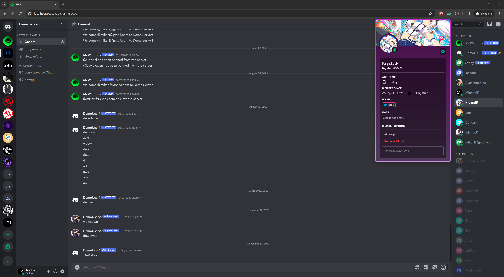

# Strife "$TR!F3" (Discord Clone)

    Discord - "disagreement between people."
    Synonym Strife - "angry or bitter disagreement over fundamental issues; conflict"

## [LIVE LINK - Heroku.com](https://strife-v1.herokuapp.com/)

## [LIVE LINK - Render.com](https://strife.onrender.com/)



[STRIFE](https://strife-v1.herokuapp.com/) stylized as [$TR!F3](https://strife-v1.herokuapp.com/) is fully comprehensive, pixel perfect, functional clone of the popular VoIP platform [Discord](https://discord.com/) unlike other discord clones scattered around on the internet $TR!F3 is NOT a basic run of the mill clone that just features the basic UI layout of discord and live messaging between users. $TRIF3 is a substantial clone, possessing features not seen in others, it features the full UI layout and functionality of Discord. It also features Voice and Video calling between users two features that are not in other clones. $TR!F3 is fully asynchronous, being able to serve and render updates to users through web sockets, interactions between users such as sending invites, relationship interactions (sending/denying friend requests or blocking users), messaging, calling, updating a user or server's name, avatar, or banner, kicking or banning a user from chat all happen and reflect in real time for all online users NO BROWSER REFRESH REQUIRED.

### [Current Patch Notes for Active Build V4.0](./patch_V4_notes.md)

### [Current Patch Notes for Future Release V5.0](./patch_V5_notes.md)

***

## MVC (init)

    - Users will be able to sign up, create an account, sign out etc,
    - Users will be able to friend, block, and send messages to one another
    - Users also will be able to join servers /create servers and chat 
    - users can like , comment/reply to a message of another user.
    - users can delete servers/messages
    - proposed bonus (after project is near fully implemented): implemment a bot to the clone to send messages to the server tech used for this at the moment is tba.           (most likely using discords api libary with cpp)

## MVP (Overall)

    -This is the overall MVP for the clone 
    1). User Authentication - using ruby rail BCrypt libary on the backend (custom implemented (not using built in auth systems))
    2). Servers (users can create their own server, which includes (adding server name, members/invite members, assign member roles, chat/message users, remove users,etc))
    3). Channels with servers
    4). Live Chat
    5). Direct Messaging via private servers 

***

## Future Additions

- Servers will now be able to use voice and video calling currently this is restricted to dm servers at the moment, as future plans for channels in servers are to be seperate components themselves depending on the channels type, voice, text, thread all are different components.
- Increase RTC connection pool between users allowing for group calling, at the moment calls are one to one only do to performance issues.
- Context menus on right click.
- Emojis.
- Message Attachments, url parsing for embeded youtube videos.
- Message reply chaining.
- @username mentions for messages.
- Server profiles
- Full Display name intergration (70% complete).
- User decoration and profile effects.
- Theme switching (already in development)
- Invites messages only for non demo accounts for servers (60% complete)
- Preview Server from guild exploration (10% complete)
- Channel catergories (10% complete)
- Server folder (10% complete) this is a bubble folder that houses several servers within it.
- Draggable containers.
- Intergation of Slade to replace chat box area with a more elegant rich text editor.
- Add much, much more.

## Technologies Utilized

STRIFE "$TR!F3" as of Patch V4.0:

- Front-End
  - ```React 18``` and ```Redux``` for frontend state management, design and rendering of components.
  - ```HTML5``` and ```JSX``` for website structure and design of ```React``` Components.
  - ```CSS3``` and ```SCSS``` for styling elements of website structure and ```React``` Components.
  - ```JavaScript(EM6)``` for dynamic updates to the frontend and other front-end logic overall code base of STRIFE's functionality is written in ```JavaScript``` .
  - ```WebPack``` and ```Babel``` as the module bundler and for live Transpilation of ```JavaScript``` .
  - ```AJAX``` to communicate with ```PostgreSQL``` Server in addition to sending and retrieving data in ```JSON``` format.
  - ```Node.js``` for libraries including ```@rails/actioncable``` for handling ```Rails ActionCable WebSockets```.
  - ```WebRTC``` API for enabling the ability to allow both video and audio calling between users.
  - ```Material UI``` library (modern) for implementing  and designing complex input containers such as custom sliders to work on all browsers, majority of input components in $TR!F3 are created from scratch only tedious and complex components are made with material UI.
  - ```@mui/styled-engine-sc``` mui uses the ```emotion engine``` as its default styling engine for styling its components however it is slow due to its generation of ~100's of style tags in the header tag upon rendering components containing mui components. Using this engine if phenomenally faster barely a cost in performance and rendering time.
  - ```SVGR``` and ```SVGO``` as tools to quickly and easily convert SVG code into SVG React Components to make svg usage easy and maintain clean code and allow more reuse of similar svgs around the app and reduce the overall space each file takes up.  
  - ```JQuery``` and ```JQuery Rails``` after a long period of avoiding the use of JQuery on the front-end with the exception of Ajax calls the use of JQuery has been used to easily execute class animations, promises, etc.
  
- Back-End
  - ```jBuilder``` for returning database data in ```JSON``` formatting to the front-end.
  - ```Ruby v3.2.2``` latest version of ```Ruby``` for coding the backend server, logic and database handling.
  - ```Ruby on Rails v7.0.8``` latest version of ```Ruby on Rails``` as the web application framework allowing Database handling, user authentication with Ruby BCrypt library, Application Record, Action View and Action Cable.
  - ```PostgreSQL``` as the Database for data storage and managment.
  - ```AWS``` (Amazon Web Service) for storing App assets and storing user uploaded assets including user and server profile avatars, banners and server invite splash images.
- Full-Stack
  - ```WebRTC``` Api in combination with Rails ActionCable  to allow both video and voice calling between users.
  - ```Rails Action Cable```, ```Redis```, and ```JavaScripts @rails/actioncable``` as the Applications WebSocket Provider handling both front-end and back-end request allowing for async functionality across the entire application. Allowing for live updates in receiving user updates, friend requests, invited dmServers and Servers, Live text messaging, voice and video calling.
  - ```Render``` $TR!F3 currently uses [Render](https://render.com/) as an alternative deployment platform and live hosting service.
  - ```Heroku``` STRIFE has moved back to [Heroku](https://id.heroku.com/login) and will serve as the main live deployment and hosting service for STRIFE.

- Former Tech Stack
  - ```Emotion``` the emotion library/engine is a "performant" and flexible CSS in JS Library which is used by default the styling engine ```Material UI``` uses to style its components. Despite being "performant" this engine has been replaced with a better alternative as using material ui with it causes massive slowdown on rendering components that use mui components. As it generates style tags for all styles for each mui component in the header tag, which can be hundreds of style tags being generated at a time which slows the app down signifcantly after investigation it was quickly replaced with one of MUI's alternative styling engines ```@mui/styled-engine-sc``` otherwise known as MUI Styled Engine for Styled Components.
  - ```Rails version 5.2.8``` this was used as part of the default tech stack required by App Academy as the project grew and this version of rails has ceased support by the rails development team and was nearing its support on Heroku. The version of rails and ruby was moved to the newer versions in transistion to the current versions of ruby and ruby on rails.
  - ```Ruby version 2.5.1``` this was used as part of the default tech stack required by App Academy as the project grew and this version of rails has ceased support by the rails development team and was nearing its support on Heroku. The version of rails and ruby was moved to the newer versions in transistion to the current versions of ruby and ruby on rails.

- Future Stack
  - ```RUST``` as the backend programming language and ```Rocket.rs``` as the web application framework.
  - Eventually I will want to port over this and any future Versions of STRIFE using ```Ruby on Rails``` backend to use ```RUST``` via ```Rocket.rs``` for a faster, safer web framework and web server. And allow much faster and greater performance overall.
  - ```React``` with ```TypeScript``` for more robust frontend and have more type restricting on the frontend.
  - ```Railway``` for future deployment and live hosting for this and any future version of Strife.
- Other Tools
  - ```Webpack Bundle Analyzer``` used to generate a distribution map of the projects bundled assets to analyze which components are taking up the most space.
  - ```React Developer Tools``` used to analyze React Components with abilites to view components state, props, and use other useful tools.
    - ```React Developer Tools - Components``` view Components state, props, providers, routing etc.
    - ```React Developer Tools - Profiler - FlameGraph``` an extremely useful tool to record the rendering of Components generate a chart/map of all components and elements being rendered during recording in the order of which they are rendered with the times it takes to render and process for each components with useful colors and timestamps to show what components are causes for performance issues, slow rendering and execution times this was used to identify problems with the mui library caused by the Emotion engine and was used to optimize styling and using mui components that gave the fastest performance possible, enough to the point where components would render nearly to the same time prior to using mui components in the first place.
  - ```Redux Dev Tools``` used to analyze Redux state of the application and view a more complete distribution of the application state i n various graphs and charts and be able to analyze redux state calls more closely.
  - ```Vim (NeoVim along with its plugins)``` for whenever Vscode would bug out or would run slowly do to other running projects.
- Editors
  - ```Visual Studio Code``` as Main code editor
  - ```Vim (NeoVim along with its plugins)``` for whenever Vscode would bug out or would run slowly do to other running projects.
  - ```Boxy SVG Editor (Browser Version)``` used to edit and create svgs for default group and profile avatars, discord uses multiple png files with different colors to serve as the default group chats and user avatars using an svg allows to use one file and recolor it for each user or group.
  - ```EZGIF.com``` used for converting certain assets of discords such as profile effect images into a combined or split files for use through SCSS.
- Other Tech
  - ```C++``` most of the files coded in C++ are long gone, but they where used with a old program to parse data to auto re-seed the postgreSQL database with data without having to manually re-seed or drop the database via rails console similar to knex.js or EF Core, It was also used to generate seed data easier into a csv format without having to painstakingly do it manually. This as a Whole has been replaced with rails console and vs code plugins despite it being a bit tedious.

***

## Project Setup and Installation

- Setup a directory and git clone this repository or fork it.
- run bundle install && npm install
- bundle exec rails db:setup
- In a seperate console run npm run start
- In the previous console run rails s or rails s -p {"DESIRED_PORT_NUMBER"}

## Disclaimer and Project Usage

- If you are viewing project on render current on 11/18/2023 please note that the Render.com deployment of this project is too slow as renders free tier is unable to handle the current seed data. Please see the Heroku version for the best performance and all the features I have been able to place into $TR!F3. Please browse this app as you would discord as this is not only something that just looks like discord but functions just like it featuring modals and effects similar to the real thing when using it.
- If browsing this app on either DemoUser1 or DemoUser2 accounts note that Demo and bot accounts are not allowed to change their user props. this is to prevent other viewers from modifying any user account credentials to these accounts which would prevent any future user from browsing the app via a demo account.
- Feel free to offer suggestions, fixes, or optimizations to the project, if there are any bugs please submit a pull request or raise an issue stating the bug, and also any potential fixes if any. If offering a potential fix please do your best to explain your findings, your method of addressing the issue, also please test and provide such test examples as well. It will make it easier for me to check and merge the change. (If your fix is passable I will merge the pull request/contribution, You'll also receive credit on the line of code and in any upcoming patch notes )
- This projects visual assests are of the property and owned by Discord and other Artist.
- You cannot use this project in anyway to monetize, sell or receive profit from it or any versions of it even those created by other users.
- This Project also follows the rules of the GNU General Public License.
- This project is currently still active in development for the forseeable future till any planned features are too taxing on the ruby rails backend. Once that has been reached $TRIF3 will move to a new version to utilize RUST as its backend via Rocket.rs web framework where speed and performance will increase massively and extra hardware intensive features will be added.

## Project Stats

- Current Project development time ~> 4800 hours.
