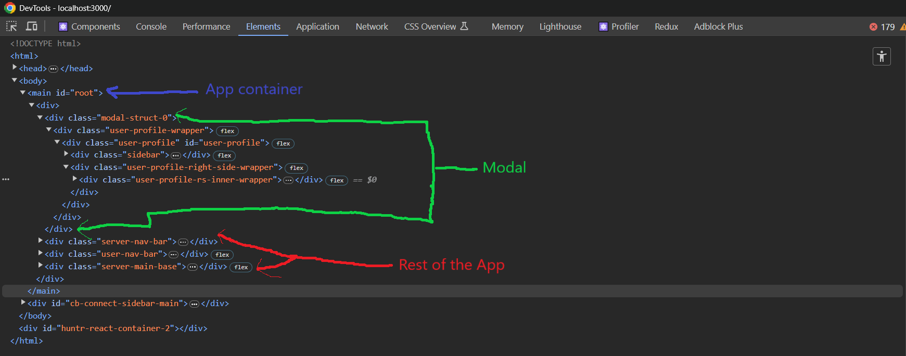
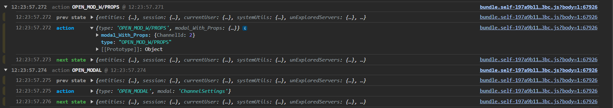
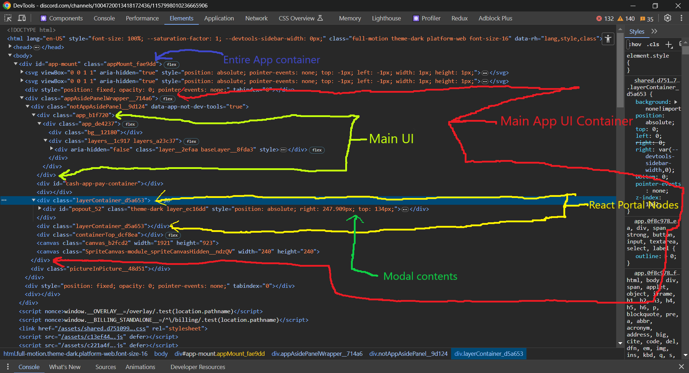
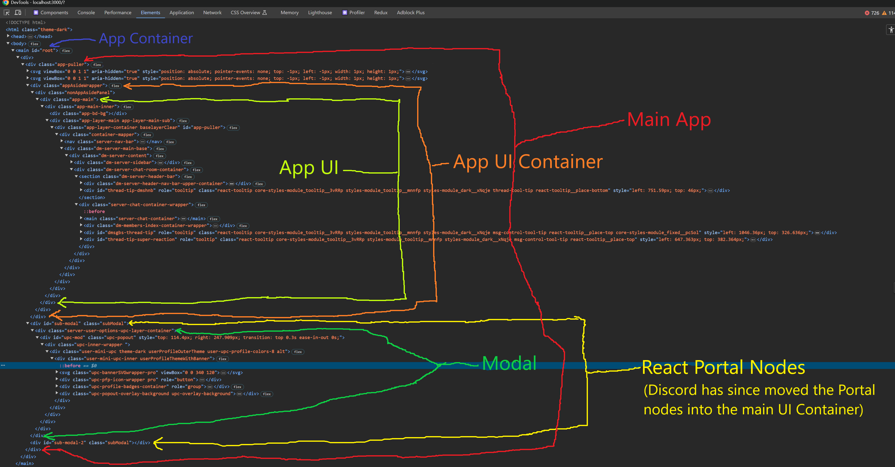

# Strife "$TR!F3" (Discord Clone)

    Discord - "disagreement between people."
    Synonym Strife - "angry or bitter disagreement over fundamental issues; conflict"

## [LIVE LINK - Heroku.com](https://strife-v1.herokuapp.com/)

## [LIVE LINK - Render.com](https://strife.onrender.com/)


[STRIFE](https://strife-v1.herokuapp.com/) stylized as [$TR!F3](https://strife-v1.herokuapp.com/) is fully comprehensive, pixel perfect, functional clone of the popular VoIP platform [Discord](https://discord.com/) unlike other discord clones scattered around on the internet $TR!F3 is NOT a basic run of the mill clone that just features the basic UI layout of discord and live messaging between users. $TRIF3 is a substantial clone, possessing features not seen in others, it features the full UI layout and functionality of Discord. It also features Voice and Video calling between users two features that are not in other clones. $TR!F3 is fully asynchronous, being able to serve and render updates to users through web sockets, interactions between users such as sending invites, relationship interactions (sending/denying friend requests or blocking users), messaging, calling, updating a user or server's name, avatar, or banner, kicking or banning a user from chat all happen and reflect in real time for all online users NO BROWSER REFRESH REQUIRED.

### [Current Patch Notes for Active Build V4.0](./patch_V4_notes.md)

### [Current Patch Notes for Future Release V5.0](./patch_V5_notes.md)

***

## MVC (init)

    - Users will be able to sign up, create an account, sign out etc,
    - Users will be able to friend, block, and send messages to one another
    - Users also will be able to join servers /create servers and chat 
    - users can like , comment/reply to a message of another user.
    - users can delete servers/messages
    - proposed bonus (after project is near fully implemented): implemment a bot to the clone to send messages to the server tech used for this at the moment is tba.           (most likely using discords api libary with cpp)

## MVP (Overall)

    -This is the overall MVP for the clone 
    1). User Authentication - using ruby rail BCrypt libary on the backend (custom implemented (not using built in auth systems))
    2). Servers (users can create their own server, which includes (adding server name, members/invite members, assign member roles, chat/message users, remove users,etc))
    3). Channels with servers
    4). Live Chat
    5). Direct Messaging via private servers 

***

## Major Features and Code Snippets

### Pixel & Functionally Perfect UI

- Check it out! $TR!F3 UI and functionality is near exactly the same to that of discord, besides some custom cosmetic designs it is completely unnoticably different from the real thing.

### Live Chat

https://github.com/miker704/Strife/assets/33719996/3533691e-88d5-4120-b2f9-988f2772c50c

Theres alot being shown here in the above clip, a user is able to send a message to other user(s) in real time, users are able to edit or delete a message they've sent before and those changes are reflected in real time to all other users in the server or dmserver. Also on the screen at 0:15 in the video if a user clicks on the red trash icon on the message control component will open up the same delete message modal that discord has. The modal displays the message, timestamp, and user avatar asking  for confirmation if they want to proceed in deleting the message or not. If you have noticed at 0:16 in the video there is a Pro Tip in green font at the bottom of the delete messgae modal that states by holding shift when clicking on the delete message button they can bypass the confirmation and delete the message entirely. Which is demonstrated at 0:20 - 0:26 in the above video. These features also apply to chats in servers as well and all reflect in real time as well.

https://github.com/miker704/Strife/assets/33719996/17d3bf93-15b3-42f3-ab2c-ec906adae034

Seems basic ? how about a group chat between four users at once

https://github.com/miker704/Strife/assets/33719996/cc87cda9-8364-4dc2-929e-b40850cbbc41

As you can see there is really now limit to how many users you can live messsage at once.

```js

//from server_chat_room.jsx

    subscribe () {

        //plug the cable
        const cable = createConsumer('ws://localhost:3000/cable'); // /cable mounts to local host that rails server is running on 
        this.subscription = cable.subscriptions.create(
            { channel: 'StrifeServer', id: this.props.match.params.channelId },
            {
                received: ({ message, head, path, type, channel, banned, bannedUser }) => {
                    switch (type) {
                        case 'RECEIVE_CHANNEL_MESSAGE':
                            this.props.receiveMessage(message);
                            break;
                        case 'UPDATE_CHANNEL_MESSAGE':
                            this.props.receiveUpdateMessage(message);
                            break;
                        case 'REMOVE_CHANNEL_MESSAGE':
                            this.props.removeMessage(message.id);
                            break;
                        ...
                    }

                },
                ...
            }
        );

    }

    handleSubmit (e) {
        e.preventDefault();
        e.stopPropagation();
        let messageBody = this.state.value;
        if (messageBody.length === 0 || messageBody.replace(/\s/g, '').length === 0) { return; }
        let modedMessage = {
            body: messageBody.trim(),
            author_id: this.props.currentUser.id,
            channel_id: parseInt(this.props.match.params.channelId)
        };
        this.props.createMessage(modedMessage).then(() => {
            this.setState({ value: '' });
            this.scrollToBottomOfChat("instant");
        });
    }

```

```js

// from server_message_control

<>
    <div className="message-accessories-button" data-tooltip-id="msgbs-thread-tip" data-tooltip-place="top" data-tooltip-content="Edit" onClick={() => props.openEdit()}
        onMouseEnter={(e) => { e.stopPropagation(); props.setMsgCtrlTTHover(true) }}
        onMouseLeave={(e) => { e.stopPropagation(); props.setMsgCtrlTTHover(false) }}>
        <PenEditIcon className="pen-icon" width={16} height={16} />
    </div>

    <div className="message-accessories-button" data-tooltip-id="msgbs-thread-tip" data-tooltip-place="top" data-tooltip-content="Delete"
        onMouseEnter={(e) => { e.stopPropagation(); props.setMsgCtrlTTHover(true) }}
        onMouseLeave={(e) => { e.stopPropagation(); props.setMsgCtrlTTHover(false) }}
        onClick={(e) => {
            if (e.shiftKey) { props.deleteMessage(props.message.id) }
            else {
                props.openModalWithProps({
                    message: props.message,
                    serverId: props.serverId,
                    channelId: props.channelId,
                    messageAuthor: props.messageAuthor,
                    server: props.server,
                });
                props.setRenderDeleteChannelMessage(true);
            }
        }}>
        <TrashCanIcon className="delete-msg-icon danger-warning-del-msg" width={24} height={24} />
    </div>
</>

```

```js

// from server_messages.jsx

    const openEdit = () => {
        setShowMsgEdit(true);
    }

    useEffect(() => {
        if (showMsgEdit) {
            editMsgFormRef.current.scrollIntoView(true);
            editMsgRef.current.focus();
        }
    })

    const handleEdit = (e) => {
        e.preventDefault();
        e.stopPropagation();

        if (value.length === 0 || value.replace(/\s/g, '').length === 0) {
            //reset back the value to dmMessage body just incase user aborts deletion
            // if a user sends a blank message or a message containing only spaces ask if the user
            //wants to delete their message instead.
            setValue(props.message.body);
            props.openModalWithProps({
                message: props.message,
                serverId: props.serverId,
                channelId: props.channelId,
                messageAuthor: props.messageAuthor,
                server: props.server,
            });
            props.setRenderDeleteChannelMessage(true);

        }

        else if (value !== props.message.body) {
            let editedMessage = {
                id: props.message.id,
                body: value.trim(),
                channel_id: parseInt(props.channelId),
                author_id: props.currentUser.id
            }
            props.updateMessage(editedMessage);
        }
        setShowMsgEdit(false);
    };

```

The code to control, send, edit, and delete messages spans over multiple components when a user type in a message in the text area of a server or dm and hits enter its is first validated to ensure the message is not empty then it is sent to the back-end to be created once it is a request is sent to ```StrifeServer``` which brodcasts to that servers channel the message that was just created which is then dispatched to be rendered on screen for all users when it returns back to the server chat cable subscribe function. the switch case handles what type of request that was just performed receive, remove, or update channel message and thee proper dispatch function is called to handle and render the appropiate actions. When a user wants to edit or delete a message they must hover over the message that they made (they are not allowed to modify other users messages) an component called ```message_control``` appear with buttons that offer a variety of options from copying the message id to editing or deleting the message if the user clicks on edit. A text area field expands and opens up surrounding the message to be edited a user can hit enter to submit the changes however checks are ran to ensure the edited message is not empty or the same message as before if so it aborts the changes and resets the  message back to orginal state else runs the update function and the the edited message changes are sent to all members to the server and rendered live. If the user clicks the red trash can icon on a message a modal called ```deleteMessageModal``` comes up displaying the message in question asking for the users confirmation to delete it if they the message is deleted and removed from view on all users screens. If the user holds down the shift key the clicks the delete button they will delete the message outright skipping the confirmation modal entirely.

### Server and Dm Protection

https://github.com/miker704/Strife/assets/33719996/97b0227d-82b5-42ef-87b3-56fc5ba95f5e

If a user enters a route to a server or dm Server that they no longer or have no membership to they will be booted to a loading screen preventing them
from accessing the potential server or dm server and eventually be returned to the dashboard.

```js

//from protect_dm_server_container.js similar to code for protect_server_container.js

const mSTP = (state, ownProps) => {

    return {
        isMember: state.currentUser.dmServersJoined.includes(parseInt(ownProps.match.params.dmServerId))
    }
}

const PROTECTED_DM_SERVER = ({isMember, path, exact }) => {
    if (isMember === false || isMember === undefined ||isMember === null ) { 
        console.warn('UNAUTHORIZED ACCESS ERROR : 401 -> REDIRECTING ...');
     }

    return (
        <Route
            path={path}
            exact={exact}
            render={props => (
                isMember ? <DmServerContainer {...props} /> : <Redirect to={'/$/$TR!F3-INTRUSION-PREVENTION/'} />
            )} />
    )
}

```

Here we check if isMember returns true which checks that state of the current user which contains the membership information for both servers and dm servers the current user has membership too. A return of true indicates the current user is a member of the current dm/server and the application proceed to render the dmm/server if a return of false is given instead the user is booted to the intrusion prevention loading screen where they will eventually retunr back the the dashboard (home). The code above is identical for the Protecting Servers in  protect_server_container.js. with the exception of passing the component ```<ServerContainer {...props} />``` instead of ```<DmServerContainer {...props} />```.

### Direct Message from Server

- A user can directly message another user while in a server or group dm by click on a users username on the server/dm members list will open that users
profile card there the current user can either click the message user button, or type in a message and hit the enter key to then send a message to that user, if the current user already has a dm with the user they will be teleport to that dm server for that user, if not a dm server is created and the messsage is sent after which the current user is teleport to the newly create dm. Before a user attempts to message a user through methods like these a check if ran to see if the current relationship between the two users is valid i.e. if either user has blocked the other user stop the message from going through.

Creation of a Dm from a server via messaging from a user profile card modal.

https://github.com/miker704/Strife/assets/33719996/f1d0c8ea-5d22-4562-98cd-54783a6ba748

Creation of a Dm from a server via clicking the message button from a user profile card modal.

https://github.com/miker704/Strife/assets/33719996/6bcb766f-d951-4d4a-9ee1-2ac4783eb90a


Warping to an existing dm from a server via clicking the message button.

https://github.com/miker704/Strife/assets/33719996/9d7d12cf-f3c3-4771-8e05-cc1898a9bf90


Warping to an existing dm from a server via enter a message.

https://github.com/miker704/Strife/assets/33719996/5392949c-f7ca-498b-8f6b-c666af970d9e


You can also create or warp to a dm within a group dm and by clicking on a users name or avatar on a previous sent message, you can also do in a server as well.

https://github.com/miker704/Strife/assets/33719996/d57dfa55-fa17-4775-9847-8a54cf2234cb


```jsx

// from server_user_options_modal.jsx

    // handling a dm message entered into the text input on the upc modal first checks if the current user blocked this user or was blocked
    // if so abort the message creation if not proceed.
    const handleDmMessageVerification = (e) => {

        //if case on the other side if the user has changed being interacted with the relationship status has changed 
        // check if the the current user has been blocked if so deny the message being sent
        // also validate the message being sent if it is empty after white space removal (i.e. spaces, tabs enter or carriage returns)
        // call the function to handle the message else close the modal instead.
        let blockIds = [-2, -1];

        if (message.length === 0 || message.replace(/\s/g, '').length === 0) {
            props.setShowPopup(false);
            return;
        }
        else {
            fetchUser(props.memberId).then((result) => {
                if (blockIds.includes(result.friend_request_status)) {
                    props.setShowPopup(false);
                    return;
                }
                else {
                    handleDmMessage(e);
                }

            }, (error) => {
                props.setShowPopup(false);
            })
        }

    }

    // for creation of a dm server with a dm message
    // if the user is not blocked or has not blocked the current user proceed to read state for dm servers the user has and check if one exists with the other user already if so create the message and warp to the dm server if not create the dm and dm message then warp to it.
    const handleDmMessage = (e) => {
        e.preventDefault();
        e.stopPropagation();
        const memberIds = [props.currentUser.id, parseInt(member.id)].sort((a, b) => a - b);
        let new_dm_members = [props.currentUser, member];

        for (let dmServer of props.dmServers) {
            if (dmMembersArray(Object.values(dmServer.members).map((member) => member.id).sort((a, b) => a - b), memberIds)) {
                const messageHash = {
                    body: message.trim(),
                    sender_id: parseInt(props.currentUserId),
                    dm_server_id: dmServer.id
                }
                
                if (props.history.location.pathname !== `/$/channels/@me/${dmServer.id}`) {
                    props.sendDmMessage(messageHash);
                    props.history.push(`/$/channels/@me/${dmServer.id}`);
                    props.setShowPopup(false);

                }
                else if (props.history.location.pathname === `/$/channels/@me/${dmServer.id}`) {
                    props.sendDmMessage(messageHash);
                    props.setShowPopup(false);
                }
                return;
            }
        }
      
        let submissionState = {
            owner_id: props.currentUser.id,
            dm_member_ids: memberIds
        }
        let newDmServer;
        props.createDmServer(submissionState).then((action) => {
            newDmServer = action.dmserver;
            const messageHash = {
                body: message,
                sender_id: parseInt(props.currentUserId),
                dm_server_id: newDmServer.id
            }
            props.sendDmMessage(messageHash);
            App.StrifeCore.perform('parse_New_Invited_DM_Member', { dm_member_id: member.id, dm_server_id: newDmServer.id });
            props.reSyncCurrentUser(props.currentUserId).then(() => {
                props.history.push(`/$/channels/@me/${newDmServer.id}`);
                props.setShowPopup(false);
            })

        });
        return;
    }


    // validate the current user's relationship with the other user when attempting to create or warp to a dm server when using the message button
    const handleDmVerification = (e) => {
        e.preventDefault();
        e.stopPropagation();
        let blockIds = [-2, -1];
        fetchUser(props.memberId).then((result) => {
            if (blockIds.includes(result.friend_request_status)) {
                props.setShowPopup(false);
                return;
            }
            else {
                handleDm(e);
            }

        }, (error) => { props.setShowPopup(false); })

    }

    // if the validation is approved for create or warp to dm via message button click this function will run and check for an existing dm and warp to it or create one if it does not exist and warp to it.

    const handleDm = (e) => {
        e.preventDefault();
        e.stopPropagation();

        const memberIds = [props.currentUser.id, parseInt(member.id)].sort((a, b) => a - b);
        let new_dm_members = [props.currentUser, member];

        for (let dmServer of props.dmServers) {
            if (dmMembersArray(Object.values(dmServer.members).map((member) => member.id).sort((a, b) => a - b), memberIds)) {
                if (props.history.location.pathname !== `/$/channels/@me/${dmServer.id}`) {
                    props.history.push(`/$/channels/@me/${dmServer.id}`);
                }
                else{
                    props.setShowPopup(false);
                }
                return;
            }
        }
      
        let submissionState = {
            owner_id: props.currentUser.id,
            dm_member_ids: memberIds
        }
        let newDmServer;
        props.createDmServer(submissionState).then((action) => {
            newDmServer = action.dmserver;
            //add cable to send member id 
            //we do send a request to receive all dmservers instead because sending a single dmserver causes the 
            //message in the new server to render to that members screen if they are in some other dmserver 
            App.StrifeCore.perform('parse_New_Invited_DM_Member', { dm_member_id: member.id, dm_server_id: newDmServer.id });
            props.reSyncCurrentUser(props.currentUserId).then(() => {
                props.history.push(`/$/channels/@me/${newDmServer.id}`);
                props.setShowPopup(false);
            })
        });

        return;
    }


```

The following code basically depending on which method the user chooses to message another user in this case via entering a message in the other users UPC and hitting enter first runs the function ```handleDmMessageVerification(e)``` which checks if the current message entered satisfies the conditions for length and is not empty after trimming whitespace from the message input if it does meet requirments the function is aborted if the is satisfied it check if the current user has blocked, been blocked by the other user or both users have blocked each other in the time it took to hit enter to send the message if the relationship status between the users have changed to a -1 (current user blocked the user), or -2 (user blocked the current user but current user hasnt) indicating some block between the two users has occured and if it has abort any further action the same process is handled by the function ```handleDmVerification(e)``` when clicking on the message button instead of typing in a message except their is no message length validation as the user is not sending a message here but choosing to create or warp to an existing dm with the user. After the dm message and/or the relationship between the current user and the user being messaged has been satisfied the functions ```handleDmMessage(e)``` for sending a dm message or ```handleDm(e)``` for creating or warping to dm server with the user are ran first the function scans redux state of the current user to check if there is an existing one to one dm server with the other user if so create the dm message and send it the exisiting dm server then warp to it. If the dm server does not exist proceed to create the dm server now here the backend controller will check to see if there is a dm server between the two users that exists that is currently missing from redux state and if such a dm server exists return it, else create a new dm server with create a dm membership for both of them and return this result, here a dm message is then created and submitted to the dmserver and the current user will then under go a resync of their data to ensure their information is up to date and then be warped to the new dm server. If a new dm server is being created upon creating the new dm message the following code ```App.StrifeCore.perform('parse_New_Invited_DM_Member', { dm_member_id: member.id, dm_server_id: newDmServer.id });``` is ran this signals the Backend Rails action cable channel Strife_core to then process the successful dm server creation and send a signal to the other user if they are online which will signal a redux dispatch on that users front-end to allow them to receive the new dm server in real time. This same process applies to the message button option as well but without the creation of a dm message.


### Guild Exploration

There are many ways for a user to join a server and just like in discord $TRIF3 also features the guild exploration (servers are referred to as Guilds) users can view some of the popular guilds on $TRIF3 or search for a guild to join. The UI of the explore guilds page is exactly the same as discords. Guilds that are private are hidden from view but Users are able to join public guilds while browsing using a demo account to join private servers as well.

https://github.com/miker704/Strife/assets/33719996/05d137dd-5532-48bd-b807-11d316955e20

```jsx

    // from explore_servers.jsx

    const unExploredServersSearchResults = _liveSearch(Object.values(props.unExploredServers)).map((server, serverIdx) => {
        ...
    })

    const unExploredServers = Object.values(props.unExploredServers).slice(0, 20).map((server) => {
         ...        
        return (
            <div className="loaded-guilds" key={server.id}>
                <div className="guild-card" role="button" tabIndex={0}>
                    <div className="guild-card-header">
                        <div className="guild-card-splash">
                            {defaultServerBanner}
                            {serverBanner}
                        </div>

                        <div className="action-buttons-layer">
                            <div className="action-buttons-container">
                                <div className="action-buttons-wrapper">
                                    <div className="action-button" role="button" 
                                        onClick={(e) => {
                                            handlePopupShow(e, server);
                                        }}>
                                        <OverFlowEllipsisIcon className="action-button-icon" />
                                    </div>
                                </div>
                            </div>
                        </div>

                        <div className="guildIcon">
                            {defaultServerAvatar}
                            {serverAvatar}
                        </div>
                    </div>

                    {showPopUp && selectedServer.id === server.id && 
                        <ActionButtonPopUpContainer serverLink={selectedServerLink} setShowPopUp={setShowPopUp} 
                            boundingClient={boundingClient} />
                    }

                    <div className="guild-card-info">
                        
                        ...

                        <div className="flex-to-end">
                            <button type="button"
                                className="faint-boost-shiny-button join-server"
                                disabled={server.joined_server === true ? true : server.public === false ? true : false}
                                onClick={() => {
                                    joinThisServer(server);
                                }}>
                                <div className="shiny-button-contents">
                                    {`${server.joined_server === true ? `Server Joined` : server.public === false ? `Private Server` : `Join Server`}`}
                                    ...
                                </div>
                            </button>
                        </div>
                        
                        ...

                    </div>
                </div>
            </div>
        )
    })

    const joinThisServer = (server) => {
        const serverSubState = {
            id: server.id,
            user_id: props.currentUser.id,
            server_name: server.server_name
        }
        props.joiningServer(server.invite_code).then((action) => {
            const joinedServer = action.server;
            props.reSyncCurrentUser(props.currentUserId).then(() => {
                props.history.push(`/$/channels/${joinedServer.id}/${joinedServer.general_channel_id}`)
            })
        })
    }

    const _liveSearch = (item) => {
        return item.filter((item, idx) => {
            if (item.server_name.toLowerCase().includes(searchText.toLowerCase())) {
                return item;
            }
            else if (searchText === "") {
                return item;
            }
        })
    }

    const handleEnterSearch = (e) => {
        e.preventDefault();
        if (e.currentTarget.value.length >= 2) {
            setIsLoading(true);
            setCurrentlyInSearch(true);
            setTimeout(() => {
                setIsLoading(false);
            }, 1000);
        }
    }

    const handleReturnFromSearch = (e) => {
        e.preventDefault();
        setSearchText("");
        setIsLoading(true);
        setCurrentlyInSearch(false);
        setTimeout(() => {
            setIsLoading(false);
        }, 1000);
    }


return (

    <div className={`exs-view-wrapper ${currentlyInSearch ? `searchPage-results` : ``}`}>
    ...
        {
            currentlyInSearch === false ? (

                <>
                ...
                    <div className="exs-search">
                        <div className="exs-search-box">
                            <div className="exs-search-input-wrapper">
                                <input
                                    className="exs-search-input" id="all-servers"
                                    type="search" placeholder="Explore communities"
                                    autoFocus={true} ref={inputRef} spellCheck={false}
                                    maxLength={100} autoComplete="off"
                                    onInput={(e) => checkInput(e)} value={searchText}
                                    onChange={(e) => setSearchText(e.currentTarget.value)}
                                    onKeyDown={(e) => {
                                        if (e.key === 'Enter') {
                                            handleEnterSearch(e);
                                        }
                                    }}
                                />

                            </div>
                        
                            ...

                        </div>
                    </div>

                    <div>
                        <section className="guildListSection" id="gls">
                            <div className="guild-list">
                                {
                                    isLoading ? <GuildCardGridSkeletonList listsToRender={12} /> : unExploredServers
                                }
                            </div>
                        </section>
                    </div>

                </>
            ) : (

    <div className="guild-explore-search-container">
        <div className="guild-explore-search-header">
            <div className="guild-search-back-arrow-container" aria-label="Back" role="button" tabIndex={0} onClick={(e) => handleReturnFromSearch(e)}>
                    <BackArrowIcon className="guild-back-search-arrow-left" />
            </div>
             ...
        </div>
        ...
        <div className="guild-search-container guild-search-page">
            <div className="guild-search-bar-container">
                <div className="guild-search-bar-box">
                    <div className="guild-search-bar-input-wrapper-container">
                        <input
                            className="guild-search-bar-input" id="guild-search-bar-input"
                            type="search" placeholder="Explore communities"
                            autoFocus={true} ref={inputRef} spellCheck={false}
                            maxLength={100} autoComplete="off" value={searchText}
                            onChange={(e) => setSearchText(e.currentTarget.value)}
                            onFocus={(e) => hasFocus(e)} onBlur={(e) => blurred(e)}
                        />
                    </div>
                    ...
                </div>
            </div>
        </div>

        <div className="guild-search-results-list">
            <section id="gls">
                <div className="guild-search-discovery-list-results" style={{ opacity: `1` }}>
                    {isLoading ? <GuildCardSearchSkeletonList listsToRender={12} /> :
                        _liveSearch(Object.values(props.unExploredServers)).length === 0 ? (
                            <div id="no-match" className="empty-guild-search-state-container">
                                <div className="no-servers-found-img"></div>
                                <h3 className="epssc-h3">No results found</h3>
                                <div className="epssc-st">Try searching for something else.</div>
                            </div>
                        ) : (unExploredServersSearchResults)
                    }
                </div>
            </section>
        </div>
    </div>
    )
    }
</div>
)

```

```rb
    
    # from servers_controller.rb

    def explore_Servers
        @servers = Server.all
        @auth_ids = [1,2,3,4]
        @current_user = userId.to_i ? current_user : false
        if @auth_ids.include?(@current_user.id)
            @servers = Server.all
            render :explore
        else
            @servers = Server.where("servers.public = true").includes(:channels)
            render :explore
        end
    end
```

The following code basically determine both the layout  of the ui and the control of the guild servers page. When a user enters the guild servers page
a request is sent to the back end to obtain all servers (guilds) in $TR!F3 depending on the id of the current user is an auth id (meaning they are a demo account) or a normal id will determine what guild will be displayed to the current user in the guild discovery page. If a user is a demo account the backend will return all servers within $TR!F3 including private ones (private servers are shown for demo accounts to make it easier for browsers to use certain features that require the need of a invite link to a server.) If a user is not a demo account the backend will return all servers that are only public to be displayed in the guild discovery page. Non demo accounts cannot search and attain private servers through the guild discover page. They need to obtain an invite link from another user to join a private server. Note that for demo purposes only, servers that the current user has joined already (with exception of private servers if the current user is not a demo account) will be listed as well.

On the front end while waiting for the request to obtain the guilds the component ```<GuildCardSearchSkeletonList listsToRender={12} />``` is rendered this is a custom skeleton component built with custom ```MUI``` components and stying to mimic the same loading skeletons used by discord for its guild item cards. Once a the request has been filled a slice of the current returned guilds held in ```props.unExploredServers``` will be displayed in the featured section of the guild page. This is limited to 20 guilds. which is held within the var ```unExploredServers```. When a user enters a search query into the search bar and hits enter (search query must be > 2 characters in length) the function ```handleEnterSearch(e)``` is ran which checks if the query search length is 2 or more in length and then sets the state ```currentlyInSearch```, ```isLoading``` to true which then causes the guild discovery page to switch to the search results page and displays a ```<GuildCardSearchSkeletonList listsToRender={12} />``` in a vertical list while the function ```_liveSearch()``` which takes in ```props.unExploredServers``` is ran, which reads state for the current search text entered for the search query then filters out the servers that do not match the query and displays them in list held in the var ```unExploredServersSearchResults``` these results replaces the ```<GuildCardSearchSkeletonList listsToRender={12} />``` component the user can then live search again for other servers matching their entered queries or click the back arrow to run ```handleReturnFromSearch(e)``` which returns to the featured section of the Guild Discovery Page. Now a user can click on the join button on a server in either the search list or in the featured section which runs the function ```joinThisServer()``` which takes in the current server props of that server and runs a request ```props.joiningServer(server.invite_code)``` which takes in the servers invite code and creates a server membership to that server for the current user once a successful membership is created the function ```props.reSyncCurrentUser()``` is ran to resync the current users data and then proceeds to teleport the user to their newly joined server.


### Joining a Server Via Invite Link

In addition to being invited to a server a user can obtain a server invite link to a server and by navigating to the create a server modal and selecting the join server option, a user can submit the server invite link to join the server.

https://github.com/miker704/Strife/assets/33719996/36ce6858-e029-4bc3-bae7-8a9a8ce70cb1

```jsx

    // from create_server_form.jsx

    const handleJoinServer = (e) => {
        e.preventDefault();

        if (props.errors.length > 0) {
            props.removeServerErrors();
        }

        if (inviteCode === "") {
            setInvalidInviteCode(" - Please enter a valid invite link or invite code.");
        }
        else {
            let invite = inviteCode;

            if (invite.length < 8) {
                setInvalidInviteCode(" - The invite is invalid or has expired.");

            }
            //if valid length start the backend check to see if link/code exists
            else {
                //check to see if invite is either a code or full link
                //code is 8 chars long while the link is the code plus https://strife.gg/{code}
                if (invite.length === 8) {
                    let fullInviteLink = "https://strife.gg/" + invite.toString();
                    setInviteCode(fullInviteLink);
                    invite = fullInviteLink;
                }

                if (invite.length !== 26) {
                    setInvalidInviteCode(" - The invite is invalid or has expired.");
                }
                else {
                    let elipAnimation = document.getElementById('elip-spin-join-server');
                    let buttonText = document.getElementById("join-server-button-text");
                    let button = document.getElementById("join-Server-confirm-button");
                    buttonText.innerHTML = "";
                    elipAnimation.classList.remove('is-hidden');

                    props.joinServer(invite).then((action) => {
                        let joinedServer = action.server;
                        props.reSyncCurrentUser(props.currentUserId).then(() => {
                            props.history.push(`/$/channels/${joinedServer.id}/${joinedServer.general_channel_id}`);
                            handleCloseOnOutSideClick(e);
                        })
                    });
                    setTimeout(() => {
                        elipAnimation.classList.add('is-hidden');
                        buttonText.innerHTML = "Join Server";
                    }, 290);
                }
            }
        }
    }

```

```rb

    # from servers_controller.rb

    def join_server
        @current_user = userId
        @server = Server.find_by(invite_code: params[:inviteCode].downcase)
        
        if @server
            if (@server.members.find_by(id: current_user.id))
                @server.errors.add(:error,'You are already a member of this server')
                render json: @server.errors.full_messages, status: 422
            else
                member = ServerMembership.create!(user_id: current_user.id, server_id: @server.id)
                @response_Message = "Welcome @#{current_user.username} to #{@server.server_name}!"
                if member.save
                    all_channels = @server.channels
                    all_channels.each do |channel|
                   
                        ChannelMembership.create!(
                            channel_id: channel.id, 
                            receiver_id: current_user.id
                        )
                    @message=Message.create!(body: @response_Message, author_id: 1, channel_id: channel.id)
                    StrifeServer.broadcast_to channel,type: 'RECEIVE_CHANNEL_MESSAGE', **from_template('api/messages/show', message: @message)
                    StrifeServer.broadcast_to(channel,head: 100, type:"NEW_SERVER_MEMBER")
                    end
                        render :show

                end
            end
        else
            @server = Server.last
            render json: ['The invite is invalid or has expired.'], status: 422

        end
    end

```

When a user enters a server invite link within the create a server modal and click join server the function ```handleJoinServer(e)``` is ran which validates whether or not the current input is of valid format to be considered a server invite link if any of these validations are not satisified the function returns and displays the error "The invite is invalid or has expired"  the same is returned if the input passes validation but the backend returns an error in response indicating that no server matches the enter server invite link. If the link passes input validation the function ```props.joinServer(invite)```  is ran which sends a request to the backend where function ```join_server``` runs which checks if there is an existing server that matches that invite link if so a server membership will be created to that server for the current user along with channel memberships to each channel in that server is also created for the user. When a successful membership is created a welcome message is created and sent via action cable brodcast to that server send that message via ```StrifeServer.broadcast_to channel,type: 'RECEIVE_CHANNEL_MESSAGE', **from_template('api/messages/show', message: @message)``` which sends the welcome message to that server in live time.  Another action cable request is made again ```StrifeServer.broadcast_to(channel,head: 100, type:"NEW_SERVER_MEMBER")``` which is a request to re-render the server to show the new server member in the server member list in live time as well. The server is return from the backend to the current user and is added to redux state. The current users data is resynced by the function ```props.reSyncCurrentUser(props.currentUserId)``` before warping the user to the newly joined server while function ```handleCloseOnOutSideClick(e)``` is running which closes the modal.

#### Inviting a User to a Server and/or Receiving a Server Being Invited too in Live Time

In addtion to the aformentioed methods of joining a server those methods only work for public servers for non demo accounts in order for a user to join a private server they must be invited by another user that is a member of that server itself. When using a Demo or bot account are user that is invited to a server by a demo or bot account is forcibly joined (for demonstration purposes) while non demo accounts in send a dm to that user with an invitation to the server. Note when invite a user to a server if that user that is to be invited is online they will receive the new server in their server list LIVE.

https://github.com/miker704/Strife/assets/33719996/7badb5d0-6c8d-47a1-9934-0767702eaacc

```js

    //from invite_to_server_modal.jsx

    const inviteUserToServer = (friend) => {
        const sERVER_ID = parseInt(props.serverId)
        let button = document.getElementById(`ivsmbutton friend-${friend.id}`);
        let buttonText = document.getElementById(`ivsmbutton-text friend-${friend.id}`);
        let elipAnimation = document.getElementById(`elip-spin friend-${friend.id}`);
        elipAnimation.classList.remove('is-hidden');
        buttonText.innerText = "";

        let disableAllButtons = document.querySelectorAll('.i2sm-invite-member-button');
        disableAllButtons.forEach((button) => button.disabled = true);

        props.createServerMembership({ user_id: friend.id, server_id: sERVER_ID }).then(() => {
            App.StrifeCore.perform('webSocketReceiveNewServerViaInvite', { user_id: friend.id, server_id: sERVER_ID });
            setTimeout(() => {
                elipAnimation.classList.add('is-hidden');
                buttonText.innerText = "Sent";
                button.disabled = true;
            }, 1000);

            setTimeout(() => {
                disableAllButtons.forEach((button) => button.disabled = false);
            }, 1000);
        });

    }

```

```rb

# from server_memberships_controller.rb

    def create
        @server_Membership = ServerMembership.new(server_membership_params)
        @server = Server.find_by(id: @server_Membership.server_id)
        @first_channel = @server.channels.first
        if @server_Membership.save
            all_channels = @server.channels
            all_channels.each do |channel|
           
                ChannelMembership.create!(
                    channel_id: channel.id, 
                    receiver_id: @server_Membership.user_id
                )
            end
            async_welcome_new_member(@server,@server_Membership,@first_channel)
          render "api/servers/show"
        else
          render json: @server_Membership.errors.full_messages, status: 400
        end
    end


```


```rb

 # from strife_core.rb

  def webSocketReceiveNewServerViaInvite(_added_Server_Member)
    @new_Server_Member = User.find_by(id: _added_Server_Member['user_id'].to_i)
    if @new_Server_Member.online == true
      core = '$TR!F3_' + @new_Server_Member.id.to_s
      received({ type: 'WEB_SOCKET_RECEIVE_SERVER', core: core, newServerId: _added_Server_Member['server_id'].to_i })
    end
  end


```

```js

// from CORE_CABLE.JS

const _STRIFE_CORE_CABLE_ = (store, _global_history, props, history, currentUserId, dispatch) => (
    App.StrifeCore = App.cable.subscriptions.create({ channel: 'StrifeCore', id: store.getState().session.id }, {
        ... 
        received: (data) => {
    
            let currentDate = new Date();
            let time = currentDate.getHours() + ":" + currentDate.getMinutes() + ":" + currentDate.getSeconds() + ":" + currentDate.getMilliseconds();
            switch (data.type) {
                ...
                case 'WEB_SOCKET_RECEIVE_SERVER':
                    store.dispatch(webSocketFetchServer(data.newServerId));
                    console.info(`%c[$TR!FE M0N!T0R]: %c[WEB_SOCKET_SERVER_REFRESH%c] %c@ [${time}%c]`, "color:#00FD61;", "color:#8442f4;", "color:#8442f4;", "color:#00FD61;", "color:#00FD61;");
                    break;
                ...
                default:
                    console.warn(`%c[$TR!FE M0N!T0R]: %c[UNKNOWN REQUEST%c] %c@ [${time}%c]`, "color:#00FD61;", "color:#A12D2F;", "color:#A12D2F;", "color:#A12D2F;", "color:#A12D2F;");
                    break;
            }
            ...
        },

    }),
)

```

The following code is from the invite to server modal where a user can search their friends or any group dms they are in and invite members to a server
here the following clip above handle inviting a single user to a server the code is similar to the previous joining server methods state before but this applies to another user instead the current user clicks the invite button next to a user to invite them to the server. The Above function ```inviteUserToServer(friend)``` takes in the users info and runs the function ```props.createServerMembership()``` which creates a server membership to the server for the invited user. which is handled by the backend function ```create``` from the ```server_memberships_controller``` which creates  a server membership along with channel memberships to each channel in the server and sends a request to  create a welcome message for the new member and that message and users info is sent to the cable StrifeServer and these requests are then brodcasted to the server the user is invited to which renders the new message along with the newly invited member which appears in the member list of the server. As noted in the above clip at 0:18 the user that was invited to the server receives the invited server rendered on their server nav bar list in LIVE TIME. (this is the server with the purple avatar that appears at time 0:18 in the video above). This live rendering is done through CORE_CABLE on the front-end  which is started by the line of code ```App.StrifeCore.perform('webSocketReceiveNewServerViaInvite',{ user_id: friend.id, server_id: sERVER_ID })``` which is ran if the promise ```props.createServerMembership()``` is successful it signals ```strife core.rb``` which is the main action cable websocket channel that handles 80% of all live requests on the backend and it performs the request it takes in the invited users details along with the server details they are invited to and checks if that user is currently online and sends a request to that users frontend, to the function  ```_STRIFE_CORE_CABLE_``` which is the main cable for the frontend that handles 80% of all live requests in the app. The case ```WEB_SOCKET_RECEIVE_SERVER``` was sent to this cable which then dispatches the redux function ```store.dispatch(webSocketFetchServer(data.newServerId))``` for the user to receive the new server that they where invited to. which is then rendered immediately in LIVE TIME in that users server nav bar which you can see at 0:18 in the video clip above. This is one of the many examples of how $TR!F3 is able to handle and execute requests to render and send data to all users that are online on the server in real time no refreshing required.

So inviting single users seems cool, but doesnt discord also allow you to invite users that are members from your group dms?

#### Inviting a Group of Users from a Group DM to a Server

https://github.com/miker704/Strife/assets/33719996/021d144a-5ace-454a-81db-1b28323550e7

Well yeah you can do that too. This functionality at first seems pretty difficult as it is very error prone. But with some clever ingenuity it can be done very easily handling edge cases. And Allowing a user to invite a whole group dm of 10 members consisting of users that may or may not be friends with that user to the server. 

```js

    //from invite_to_server_modal.jsx

    const inviteUserToServerFromADmServer = (dmServer) => {
        const sERVER_ID = parseInt(props.serverId)
        ...
        props.createServerMembershipViaInjectionOfDmMembers({ memberIds: dmServer.members, server_id: sERVER_ID }).then(() => {
            App.StrifeCore.perform('webSocketReceiveNewServerViaInviteInjextion', { memberIds: dmServer.members, server_id: sERVER_ID });
            ...
        });
    }
    ...
    const filterOutCompletely = [...items, ...dmServers].filter((item) => {
        if (item.type === "FRIEND") {
            const index = findIfMemberAlready(item)
            if (index === -1) {
                return item;
            }
        }
        else if (item.type === "DM_SERVER") {
            let x = item.members.filter(id => checkViaId(id) === -1);
            if (x.length > 0) {
                item.members = x;
                return item;
            }
        }
    })

```

```rb

    # from server_memberships_controller.rb

    def createViaInjextion
        @server_Membership = nil
        multiMemberInjextion = params[:server_membership][:memberIds]
        @server = Server.find_by(id: params[:server_membership][:server_id].to_i)
        @first_channel = @server.channels.first
        @new_member_names = []

        all_channels = @server.channels
        multiMemberInjextion.each do |id|
            @server_Membership = ServerMembership.create!(user_id: id.to_i, server_id: params[:server_membership][:server_id].to_i)
            @new_member_names.push("@"+ @server_Membership.user.username)
                all_channels.each do |channel|
                    ChannelMembership.create!(
                        channel_id: channel.id, 
                        receiver_id: @server_Membership.user_id
                    )
                end
        end
        async_welcome_new_members_via_injextion(@server, @new_member_names, @first_channel)
        if @server_Membership.save
            render "api/servers/show"
        else
          render json: @server_Membership.errors.full_messages, status: 400
        end

    end

```

```rb

# from strife_core.rb

  def webSocketReceiveNewServerViaInviteInjextion(_added_Server_Members)
    membersToSignal = _added_Server_Members['memberIds']
    membersToSignal.each do |memberId|
      @new_Server_Member = User.find_by(id: memberId.to_i)
      if @new_Server_Member.online == true
        core = '$TR!F3_' + @new_Server_Member.id.to_s
        received({ type: 'WEB_SOCKET_RECEIVE_SERVER', core: core, newServerId: _added_Server_Members['server_id'].to_i })
      end
    end
  end


```

Here in this code when the invite button is clicked next to a dm server to invite its members to the server it runs the function ```nviteUserToServerFromADmServer()``` which alls on the function ```props.createServerMembershipViaInjectionOfDmMembers()``` which is a custom inject function which gathers all valid members from the dm server and extract their ids it then parses it to the backend function ```createViaInjextion```
is ran which takes the member id array an create server memberships along with channel memberships to all channels in the server for all invited users.
The users usernames are collected to also form one large group message welcoming all the new members. ```async_welcome_new_members_via_injextion(@server, @new_member_names, @first_channel)``` is ran which sends an action cable request to StrifeServer which sends the request to that server to render the new message  along with the new members on the server member list in LIVE TIME. As the members are being invited to the server it can be seen in the clip above that once inviting members from a dm  while the request is being ran all invite buttons are disabled this is to prevent the user from spamming invites to users that may be in the process of already being invited. The variable ```filterOutCompletely``` hold the list of all friends and dm servers the user can view in the invite to server modal when the current user is inviting a dm when membership is created for a person in that dm any listing of the user or any dm that contains that users id is filtered out and removed from any dm choice. this prevents any errors that can result from inviting and attempting to create membership for the same user again. The function perform request ```'webSocketReceiveNewServerViaInviteInjextion'``` is called if the injection is successful which then calls on the backend cable function of the same name which checks each member of the server that is online and sends a request to each new member to receive the invited server and have it rendered in there server nav bar in LIVE TIME similar to how a single user invite does.

#### Receiving an invite to a Dm Server live

Users can create dm servers with another user, invite more than one user or adding more users to where to where the total amount of members > 2 will create a group chat note that when inviting a user to a dm chat if that user is online they will receive that dm server live.

https://github.com/miker704/Strife/assets/33719996/30f4047e-14a6-4e8a-9ebe-4cb2e3f5e695

```js

    // from create_dm_server_modal

    const handleDmServerCreation = (e) => {
        e.preventDefault();
        const memberIds = [props.currentUser.id, ...selectedFriends.map((friend) => parseInt(friend.id))].sort((a, b) => a - b);
        if (memberIds.length > 10) {
            props.setCreateDmModal(false);
            return;
        }
        for (let dmServer of props.dmServers) {
            if (dmMembersArray(Object.values(dmServer.members).map((member) => member.id).sort((a, b) => a - b), memberIds)) {
                if (props.history.location.pathname !== `/$/channels/@me/${dmServer.id}`) {
                    props.history.push(`/$/channels/@me/${dmServer.id}`);
                }
                props.setCreateDmModal(false);
                return;
            }
        }
        let submissionState = {
            owner_id: props.currentUser.id,
            dm_member_ids: memberIds
        }
        let newDmServer;

        props.createDmServer(submissionState).then((action) => {
            newDmServer = action.dmserver;
            props.reSyncCurrentUser(props.currentUserId).then(() => {
                props.history.push(`/$/channels/@me/${newDmServer.id}`);
            })
        }).then(() => {

            let membersToInvite = Object.values(newDmServer.members);
            for (let member of membersToInvite) {
                if (member.id !== props.currentUser.id) {
                    App.StrifeCore.perform('parse_New_Invited_DM_Member', { dm_member_id: member.id, dm_server_id: newDmServer.id });
                }
            }
            props.setCreateDmModal(false);
        })

        return;
    }

```

Here when a dm server is created when members are selected and the create button is clicked depending on the amount of members selected will create a dm server of a specific type. one to one dms or group chats. One to one dms are 2 member servers where as group chats have 3 - 10 members. dms can have a max of 10 members only. selecting a single user in the create dm modal will create a one to one dm and selecting 2 - 9 members creates a group dm. When clicking create the function ```handleDmServerCreation()``` is ran which creates an array of the current user and all the selected friends and extracts their ids. the length  of this array is checked to ensure its not over 10 members in length else it aborts the function. A loop is ran to check the current redux state of dm servers the current user has and checks to see if there exists any dm or group chat that contains all of the selected members if so it warps the current user to that dm server this is to prevent creating a duplicate dm with the same members. If no existing dm can be found from redux state the function ```props.createDmServer``` is ran to create a new dm server on the backend a check is ran one more time to check if there is an existing dm that contains all the selected members already in the database if so it returns this dm server and the current user is warped to it. else if there isnt any exist dm already one is then created and the current user is then warped to it. Upon successful creation of the dm the function ```App.StrifeCore.perform('parse_New_Invited_DM_Member');``` is called on all selected members except the current user which then sends a request to the backend to send another request to the front end to receive the newly created dm on their screen in live time. which can be seen  at 0:30 in the above clip.

### React Portal For Modals

- Discord LOVES using modals throughout their application so getting them to work right is imperative.

- Many developers like to use a component called modal manager that basically a component that under certain conditions renders a specific modal from redux state as depicted here. For this example we will attempt to open a modal called Channel Settings using the modal manager would involve the following code below.

#### Old Modal Manager Code

 ```jsx
  // from app.jsx

 const App = () => (
  ....
    <div>
        <Route path='/' component={ModalManagerContainer}></Route>     {/* < ---------- Modal Manager Component is mounted here and whatever condition
                                                                                       is met the modal is rendered from here  */}

        <ProtectedRoute path="/channels/:serverId/" component={ServerNavBarContainer} />
        <ProtectedRoute path="/channels/" component={UserNavContainer} />
          <Switch>
            <ProtectedRoute path="/channels/@me/:dmServerId" component={PROTECTED_DM_SERVER_CONTAINER}/>
            <ProtectedRoute path="/channels/:serverId/:channelId" component={PROTECTED_SERVER_CONTAINER} />
            <ProtectedRoute path="/channels/@me" component={HomePageContainer} />
        </Switch>
    </div>
 )

```

```jsx

// from modal_manager.jsx 

class ModalManager extends React.Component {
    render () {

        ...
      switch (this.props.modal) {  // whatever redux state says the modal is to will render that modal 
            case 'userProfile':
                renderedModal = <UserProfileContainer />
                break;

            case 'ServerSettings':
                renderedModal = <ServerSettingsModalContainer />
                modalMod = 0;
                break;

            case 'ChannelSettings':

                renderedModal = <ChannelSettingsModalContainer mod_Channel_ID={this.props.modalProps} /> 
                modalMod = 0;

                break;
            default:
                return null;
        }

        if (!this.props.modal) {
            return null;
        }
        return (
            <div className={`modal-struct-${modalMod}`} onClick={this.props.closeModal}>
                {renderedModal}
            </div>
        );
    }
}

```

This approach is very may seem elegant at first but as the app grows and gets more complex with modals i.e. have a modal and another sub-modal over that modal are not possible one modal can be used at a time with this approach with deploying other modals on top of an active modal need to be rendered with different  approaches all of which are inferior. Also a problem with mounting the modal manager component at the top level in the react tree leads to a problem where a component at route "/channels/:serverId/:channelId" that calls for the channel modal to be rendered a large problem related to performance and access the props at the current level in the react tree arise reference the code below :

```jsx
// from channel_nav_bar.jsx
  <div
    className={`channel-settings-wrapper ${props.currentUserId === props.server.server_owner_id ?
        `` : `is-hidden`
        }`}
    data-tip data-for="channel-settings-tool-tip"
    onClick={() => {
        props.openModalWithProps({ ChannelId: channel.id })  // pass channel.id  into redux state
        props.openModal('ChannelSettings')    // open the modal after modal props has been passed through
    }}>
  </div>
```

Here when the gear button is click on the channel nav bar it passes the channel id to view the settings for into a redux state called OPEN_MOD_W/PROPS
which passes props to be used for a modal into redux state and then proceeds execute the function openModal('channelSettings'); which then calls the modal manager to render said component.

```jsx
// from modal_manager.jsx

      case 'ChannelSettings':

                renderedModal = <ChannelSettingsModalContainer mod_Channel_ID={this.props.modalProps} />  // < ------ here from redux state we pass the channel id in additon to any other props loaded into redux store from the slice OPEN_MOD_W/PROPS .
                modalMod = 0;

                break;
```

As you can see in modal manager when the condition to open the channel settings modal the following happend the component is fed mod_Channel_ID = {this.props.modalProps} which is the state that we just stored and now extracting from the slice in redux store named OPEN_MOD_W/PROPS this concept is usually referred to as 'Prop Drilling' where a parent component in the react tree passes props down to child components. However in this case the reverse is happening "Reverse Prop Drilling" in the scenerio the component modalManger is rendered at the route is `/` and accessing props from `/channels/:serverId/:channelId` is not possible so we need the child component to feed the parent props in order to render the channel settings modal correctly this process ends up getting more complicated as we also need extract the route for the current server and channel as shown below

```js

//from channel_settings_container.js
const extractServerProps = (state, ownProps) => {
    let locationString = ownProps.location.pathname;
    let newLoc = locationString.split('/channels/').join('').split('/');
    return newLoc;
}

const getCurrentChannel = (state, ownProps) => {
    let serverChannels = Object.values(state.entities.channels);
    const findThis = ownProps.mod_Channel_ID['ChannelId'];
    let currentChannelTarget = serverChannels.find((channel) => channel.id === findThis);
    return currentChannelTarget;
}

const mSTP = (state, ownProps) => {

    const getIds = extractServerProps(state, ownProps);
    const currentChannelTarget = getCurrentChannel(state,ownProps);
    return {

        currentUser: state.entities.users[state.session.id],
        server: state.entities.servers[parseInt(getIds[0])],
        channel: currentChannelTarget,
        channels: Object.values(state.entities.channels),
        currentChannelId: getIds[1],
        serverId: getIds[0],
        errors: state.errors.channel,
        serverErrors: state.errors.server,
        sessionErrors: state.errors.session,
        servers: state.entities.servers

    }
}

```

Resulting DOM Tree

Resulting Redux State


As you can see all of this is needed in order to render a modal. Even though the expected result returns the channel settings modal, I did mention performance before right ? well if a user is hopping between server and clicking on the channel settings modal guess what ?  regardless of the performance speed that all this code runs on which seems pretty fast on paper can at times be too slow for the user an results in a crash where the user that was in the route of  `/channels/5/1` heads to `/channels/4/1` too fast and opens the channel settings for channel 2 for  server 4 can result in a crash as the application has not fully changed the state to refer to the correct channel the following happens either the user trys to view a channel of id: 20 that belongs to server 5 in server 4 when there is no channel of id: 20 that exists in server 4 which causes the app to crash and the reverse can happen where user goes from server 5 to server 4 clicks the settings for channel 4 in server 4 but the route has not fully  changed to server 4 and we attempt to open channel 4 for server 5 and if server 5 has not channel 4 a crash can result. Reverse prop drilling causes a huge mess of code that can result in performance degradation as the app gets more complex and even the most optimized version of this results in crashes from time to time so i designed a far superior method using a seldom used/ known feature in react called React Portal.

#### What is React Portal?

- React Portal is both a seldomly known and used feature in react but offers extremely versatile and powerful features. By using the function
```createPortal( children, domNode, key?)``` we can create and render some children or in our case a modal component onto a different part of the DOM.

  "A portal only changes the physical placement of the DOM node. In every other way, the JSX you render into a portal acts as a child node of the React component that renders it. For example, the child can access the context provided by the parent tree, and events bubble up from children to parents according to the React tree." - [react.dev](https://react.dev/reference/react-dom/createPortal)

The way discord handles the rendering of its many pop-ups, tool tips, and modals use the concept of React Portal see image below.

How discord does it



Discord on inital refresh of the page has 4 signifcant elements  

```html
      <div className ="appMount...">  This is the main app container that contains all off the applications UI and UI assets.
            ....

           <div className ="appAsidePannelWrapper..."> 
                  This is the apps main UI container that contains all off the applications UI.

                <div className="app_...">.....</div> This is the apps main UI

                <div className="layerContainer....">...</div> These empty divs are "spawn points" for react portal to "teleport" modals, popup, etc into
                <div className="layerContainer...."></div>    (note as of November 2023) these React Portal Nodes appear within appAsidePannelWrapper
                                                              prior to this they appear outside of appAsidePannelWrapper and with appMount
           </div>   
            <!-- <div className="layerContainer....">...</div>   as of November 2023 these portal nodes appear as a child with appAsidePanelWrapper
                                                                instead of a sibling node 
            <div className="layerContainer....">...</div> -->
      </div>  
```

Strife's Replication



As you can see the method of deployment is nearly identical to that of discords.

The DOM nodes of the class name "sub-modal" or in discords case "layerContainer" are used as "spawn points" to the function ```createPortal(<Modal></Modal>,"sub-modal")``` to render the modal in. Basically create a portal at Node of class name "sub-modal" and "teleport" (render) the child (component) modal within it. This ingenius method of deploying modals elminates the need for the prior mentioned modal manager component and the need to "Reverse prop drill" props in modal components as the modal themselves can now be deployed any where within the app and do not need any additional helper functions like attaining the current route as they are able to access and read route props from its calling parent. This leads to no crashing due to performance speeds regardless of the users speed moving through the app the elimination of all of the prior functions leads to an instant deployment of a modal with the correct slice of state  percent of the time.

```js

//from ReactPortal_api_util.js

export default function REACT_PORTAL ({ children, wrapperId, classNameId }) {

    const [wrapperElement, setWrapperElement] = useState(null);
    //useLayoutEffect hook is used here as it fires before the dom is repainted which is faster than 
    // useEffect as this function handles visual effects on screen/
    useLayoutEffect(() => {
        let element = document.getElementById(wrapperId);

        let systemCreatedElement = false;

        //if element does not exist due to never existing or deleted by abnormal means create it and append 
        //to the DOM
        if (!element) {
            systemCreatedElement = true;
            element = createWrapperAndAppendToBody(wrapperId, classNameId);
        }
        setWrapperElement(element);

        return () => {
            //delete element if it was system created;
            if (systemCreatedElement && element.parentNode) {
                element.parentNode.removeChild(element);
            }
        }

    }, [wrapperId])

    //wrapper element state will be null the very first render
    if (wrapperElement === null) {
        return null;
    }

    return createPortal(children, wrapperElement);
};


function createWrapperAndAppendToBody (wrapperId, classNameId) {
    const wrapperElement = document.createElement('div');
    wrapperElement.setAttribute('id', wrapperId);
    wrapperElement.setAttribute('class', classNameId);


    if (classNameId === "subModal") {
        const spawnFromElement = document.querySelector('.appAsideWrapper')
        spawnFromElement.parentElement.insertBefore(wrapperElement, spawnFromElement.nextSibling);

    }
    else if (classNameId === "mass-modal-layer-container") {
        const spawnFromElement = document.getElementById("app-puller");
        spawnFromElement.parentElement.insertBefore(wrapperElement, spawnFromElement.nextSibling);
    }
    else {
        document.body.appendChild(wrapperElement);
    }
    return wrapperElement;
}

```

Example of usage for the User Profile Card Modal (UPC)

```jsx
// from server_user_options_modal.jsx
    return (

        <REACT_PORTAL wrapperId={'sub-modal'} classNameId={'subModal'} onClick={(e) => e.stopPropagation()}>
            <div className='server-user-options-upc-layer-container' onClick={e => handleCloseOnOuterClick(e)}>
                {serverUserOptionsContent}
                <Tooltip className="suom-server-name-tool-tip" id="suom-tool-tip" place="top" closeOnResize={true} />
            </div>
        </REACT_PORTAL>
    )
```

Here this component wrapper function servers a way to deploy modals with ```REACT_PORTAL``` is a component that wraps around the component to be rendered and accepts the following parameters the component to be rendered itself (this is passed by wrapping REACT_PORTAL around the component) in this case its the all of the elements that make up the UPC Modal the wrapperId and classNameId of the node to create the portal on and teleport the component within it in this case wrapperId = "sub-modal" and classNameId = "subModal". The classNameId parameter is typically used to refer to a specific type of modal the is going to be rendered in $TRIFE and discord there are two types of modals, sub modals which are small modals that appear in the center of the screen, on top of another modal, or modals that do not take up the full screen. Then there are Mass Modals which are typically refered to as Setting modals which occupy the entire screen and are deployed within the div of className "app" or "app-main". The function uses a useLayoutEffect hook as it fires before the dom is repainted which is faster than than the more popularly used useEffect hook. There it checks if a node exists on the DOM with the passed in id exists if not it calls on the function ```createWrapperAndAppendToBody (wrapperId, classNameId)``` which takes in the wrapperId and classNameId and creates a node of the div type and they checks whether classNameId is "subModal" or "mass-modal-layer-container" which implies if the modal to be rendered is a sub modal or a full screen modal and it will create the node and open a portal for that component to be rendered in and place it in the appropriate spot within the DOM. It returns the new node and appends this node to state the function then returns the call `createPortal(children, wrapperElement)` and renders the component at the existing or newly created portal once the user exits the modal a clean up function is ran and reads the state containing the node we stored earlier and ensures that the node and its unused assets have been cleaned up.

### Video and Voice Calling

- Yes $TR!F3 has the ability to allow users to voice and video call each other however Currently $TRIFE has limited its video and voice calling features to just dm servers only and will be implementing it into server soon in $TRIF3-v5.

Here is a demo video of it note that both video instances are using the same camera, over on heroku or render it would be 2 different cameras but you get the idea.


### Explain how core works

Core is a custom data layer controller first with intentions on defeating rails action cable websocket timeouts without the need to modify rails library files. Core is basically  a two - system both front end and backend processes Core is labeled as a action cable channel named Strife_core.rb while its front-end version id. Every user iss assigned an object called a Core which is a string with their id appended to it this allows for each user to have a unique idenitifer that can be used to send websocket requests to allowing to send muliple requests to multiple users over the network to recieve and render updates all in live time regardless where they are in the app.

### Live Time Functionality (via Asynchronous WebSockets)

- $TR!F3 has complete Async functionality being able to send and recieve requests live this is induced by the CORE Component whenever the user does something that would induce a visual change such as changing their display name, username, avatar, banner or changing a server name, avatar, banner, adding, deleting or updating channel names, or the kicking, banning, or inviting of users, joining a server, sending, accepting, or denying friend requests, blocking of users, etc if the request is successful another request is sent to the rails action cable channel strife_core where depending on the request certain validations are ran, and depending if other users are involved in the request the core proceeds to send out multiple requests to all online users to run a specific redux dispatch to then receive the new data and render these changes on screen all in live time for ALL users, no browser refreshing required!. This allows live changes to happen in areas outside of servers or dm server allowing live changes to happen anywhere in the app. Here are some of the many actions through out $TRIF3 that use them.


- kicking and banning users show 4 way browser
  - show server update via new server avatar and server channel creation
  - show channel and server settings and error shaking
  - show when a user updates a banner or photo it reflects on the other browser show how
  - show blocking of user in upc while anotheruser trys to add them.

#### Live time friend requests and relationship interactions

In $TRIF3 just like discord there are a huge amount of ways to add, remove, or block users through the dedicated add friends page entering a users username and $TRIF3 tag or through one of the many modals such as the UPC or Mega UPC Modal or through the one to one dm server first message component.
All user requests for sending, ignoring, and accepting friend requests, deleting friends, or blocking/unblocking a user all happen in real time and the changes are reflected on the other users end. All modals and components that control relationship statuses between users all share and reflect their changes between each other as you will see below.

##### Sending, Accepting, Ignoring, and Deleting friends and friend requests via the Add Friends Page

There are many ways to add friends in $TR!F3 just like discord, one way is through the add friends page which is located by selecting the add friend tab in the home dash board of the app.

By using the Add Friends tab.

https://github.com/miker704/Strife/assets/33719996/f128d1df-81e2-4d7e-9362-31fd66a9e739

Witness the live updates when adding, deleting, and blocking users.

https://github.com/miker704/Strife/assets/33719996/e49ef0e6-72e7-4642-9b1d-ee8ddc08fa7a

By combining the functionaily of the application cable class ```StrifeCore``` and the front end ```_STRIFE_CORE_CABLE_``` we can send any relationship request between two users and the returning result is not only received back by the current user but the backend server also executes a request to send the appropitate data to the other user to reflect the appropiate changes of that relationship request. Allowing both users to see changes LIVE IN REAL TIME. The current user sends a friend request to another user that user recieves a request to fetch that data and reflect that they have received a friend request if that user accepts or rejects the friend request that change is shown immediately on the current users end. Again THIS ALL HAPPENS LIVE via the CORE_CABLE of the app. Note that all the following components that allow for relationship interactions, or changes follow very similar code and follow similar websocket actions in order to reflect changes to all users in live time. This system has been carefully implemented to where users can be using different components to add each other. Which is shown here a user can add, delete, unblock, cancel, reject, approve a friend request from the friends list tabs and add friends page from the dashboard while the other user can do all of those actions using a different component that offers relationship interactions such as the MegaUPC Modal this user can send and receive updates to the relationship interactions live, if user (A) sends a friend request to user (B) from the add page tab, and User (B) is using the MegaUPC modal the buttons on the modal will change to reflect that relationship change offering the options to accept or ignore the friend request. This is the power of the core cable system allowing users to receive live updates anywhere in the app without having to refresh it just like the real thing.


```js

    // from add_friends.jsx

    const handleSubmit = (e) => {
        e.preventDefault();
        let userInfo = User_Strife_Id_Tag;
        let hashTagInfo = "";
        let userNAME = ""


        if (userInfo.includes('#')) {
            hashTagInfo = userInfo.split('#').pop();
            userNAME = userInfo.split('#').length >= 1 ? userInfo.split('#').shift() : "";
        }
        else {
            hashTagInfo = '-000';
            userNAME = userInfo;
        }

        let userStrifeId = hashTagInfo.length === 4 ? hashTagInfo : '-000';
        let userNameToSearch = userNAME.length >= 2 ? userNAME : '';
        let newFriend;

        props.fetchUserByStrifeId(userStrifeId).then((action) => {
            newFriend = action.user;
            setUsersActualStrifeId(newFriend.strife_id_tag);
            setUsersActualUserName(newFriend.username);


            props.createFriendship({ friend_id: newFriend.id, user_id: props.currentUser.id }).then((action) => {
                let new_friend_request = action.friendship;
                setFriendRequestSuccess(true);
                setUser_Strife_Id_Tag("");
                App.StrifeCore.perform('parse_add_friend_request', { new_friend_request });

            }, (error) => {
                setSaveFriendShipError(renderFriendRequestFailedErrors());
                setFailState(true);

            });

        }, (error) => {
            setSaveSessionError(renderFriendRequestErrors());
            setRenderFFEModal(true);
            setFailState(true);
            setUsersActualStrifeId("");
            setUsersActualUserName("");
        })

    }

```


```rb

# from friendships_controller.rb

    def create
        #create a friend request 
        @friendship = Friendship.create(
            user_id: current_user.id,
            friend_id: params[:friendship][:friend_id], 
            friend_request_status: 1
        )

        #this request on the friend to be added the roles are reveres when a user confirms/denies friendship
        @friend_request_reply = Friendship.create(
            user_id: params[:friendship][:friend_id], 
            friend_id: current_user.id,
            friend_request_status: 2
        )
        
        if @friendship.save && @friend_request_reply.save
            render :show
        else
            render json: ['Friend has already been taken.'], status: 422
        end

    end

```

The following function above applies to just the add friends page itself when it comes to adding a friend a user enters either the users 
usersname#Strife_id_tag or #Strife_id_tag in order to submit it an attempt to send a friend request to that user. a users #Strife_id_tag 
is the same system that discord (now deprecated and replaced due large scale difficulites) is a system that assigns a 4 digit tag from 0001 - 9999 a user to differentiate multiple userss of the same username. when a user enters another users username and strife id tag the function  ```handleSubmit(e)``` modifies the users input depending on which method they decided to uses the username + # + strife id tag or the # + strife id tag method the function formats the input which can be seen when the var ```userStrifeId``` is assigned it checks if the tag length is 4 is so the tag is assigned if not the tag of '-000' is given before sending it the function ```props.fetchUserByStrifeId()``` which takes in the strife id tag of the user and if the tag is formatted properly and matches a user it will then return the matching user. now if the tag that was sent over is '-000' this is a failsafe that tells the backend skip the search and send an error of inproper tag formating to the user on the front end also any failed attempts of adding a friend on the add friends page can bring up an error modal telling the user what went wrong as well. If there is a matching user to the provided tag that users data is returned to the front-end and the function ```props.createFriendship({ friend_id, user_id})``` is ran which sends the request to the backend to run ```create``` which create a friend request between the two users however it is not a single record that is being created but a pair of records one for the current user with a status of 1 indicating they created the request and another record for the the other user with a status of 2 which represents an incoming friend request if the other user with the status of 2 approves it both records will change to a status of 3 indicating that both users are friends. Upon successful creation a ```App.StrifeCore.perform('parse_add_friend_request')``` is performed which sends a signal to ```StrifeCore``` which sends a request to the other user to receive the friend request on their end live.

#### Cross Component Functionality

Due to the use of Core Cable updates/requests involving relationships between users can be reflected and updated between any components that offers relationship interactions which can be seen below

##### Friends Pages interact with other Relationship control modals and components example UPC Modal interacting with another users add friends page

https://github.com/miker704/Strife/assets/33719996/a7703b19-7d9e-4318-82a9-b2b2e3da6126

##### Mega UPC interacting  with other relationship control modals/components UPC

https://github.com/miker704/Strife/assets/33719996/09c51e97-e3a5-449d-9243-4dbc20ce400c

##### Relationship changes via users interacting with the UPC Modal

https://github.com/miker704/Strife/assets/33719996/e447bcbe-6869-491a-b6d3-3c18c768b464

##### Relationship changes via users interacting with the Mega UPC Modal


https://github.com/miker704/Strife/assets/33719996/7b9c003d-883b-457f-83cf-8efa9b2177ec

https://github.com/miker704/Strife/assets/33719996/d889b16a-d961-4cc6-80bd-86c099845f88

##### Relationship Changes via one to one dm server first chat message component

https://github.com/miker704/Strife/assets/33719996/04d9f7c0-6d78-46fb-9dd9-46b6752fd5f4

All the following components above use very similar processes to add, approve, cancel, ignore, block and unblock a user and all of them use the same action cable processes in order to send and receive updates to both users in real time. list below is code for adding deleting accepting, canceling and ignoring friend requests while code for blocking and unblocking a user is shown in more detail in the next section.

```js

// code shared between server user options modal (UPC), MegaUPC, MegaUPC friend options, o2o_dm_chat_first_message and all other components that use relationship features

    const handleCreateFriendShip = (e) => {
        e.preventDefault();
        fetchUser(member.id).then((result) => {
            if (result.friend_request_status === 0) {
                props.createFriendship({ user_id: props.currentUser.id, friend_id: member.id }).then((action) => {
                    let new_friend_request = action.friendship;
                    App.StrifeCore.perform('parse_add_friend_request', { new_friend_request });
                })
            }
            else { return; }
        });
        return;
    }

    const handleCancelFriendRequest = (e) => {
        e.preventDefault();
        fetchUser(props.memberId).then((result) => {
            if (result.friend_request_status === 1) {
                props.deleteFriendship({ user_id: props.currentUser.id, friend_id: member.id }).then(() => {
                    App.StrifeCore.perform('parse_delete_friend_request', { user_id: props.currentUser.id, friend_id: member.id });
                });
            }
        });
    }

    const handleAcceptFriendRequest = (e) => {
        e.preventDefault();
        fetchUser(member.id).then((result) => {
            if (result.friend_request_status === 2) {
                props.updateFriendship({ user_id: props.currentUser.id, friend_id: member.id }).then(() => {
                    App.StrifeCore.perform('parse_update_friend_request', { user_id: props.currentUser.id, friend_id: member.id });
                });
            }
        });
    }

    const handleIgnoreFriendRequest = (e) => {
        e.preventDefault();
        fetchUser(member.id).then((result) => {
            if (result.friend_request_status === 2) {
                props.deleteFriendship({ user_id: props.currentUser.id, friend_id: member.id }).then(() => {
                    App.StrifeCore.perform('parse_delete_friend_request', { user_id: props.currentUser.id, friend_id: member.id });
                });
            }
        });
    }

    const handleDeleteFriendShip = (e) => {
        e.preventDefault();
        fetchUser(props.member.id)
            .then((result) => {
                if (result.friend_request_status === 3) {
                    props.deleteFriendship({ user_id: props.currentUser.id, friend_id: props.member.id }).then(() => {
                        App.StrifeCore.perform('parse_delete_friend_request', { user_id: props.currentUser.id, friend_id: props.member.id });
                    });
                }
            })
    }

    const handleBlockUser = (e) => {
        e.preventDefault();
        let validBlockStatuses = [-2, 0];
        fetchUser(props.member.id)
            .then((result) => {
                if (validBlockStatuses.includes(result.friend_request_status) === true) {
                    props.blockUser({ user_id: props.currentUser.id, friend_id: props.member.id }).then(() => {
                        App.StrifeCore.perform('parse_block_request', { user_id: props.currentUser.id, friend_id: props.member.id });
                    });
                }
            });
        return;
    }

    const deleteRelationShipThenBlockUser = (e) => {
        e.preventDefault();
        let valid_ids = [1, 2, 3];
        fetchUser(props.member.id)
            .then((result) => {
                if (valid_ids.includes(result.friend_request_status) === true) {
                    deleteFriendship({ user_id: props.currentUser.id, friend_id: props.member.id })
                        .then(() => {
                            props.blockUser({ user_id: props.currentUser.id, friend_id: props.member.id })
                                .then(() => {
                                    App.StrifeCore.perform('parse_block_request', { user_id: props.currentUser.id, friend_id: props.member.id });
                                });
                        });
                }
            })

    }

    const handleUnBlockUser = (e) => {
        e.preventDefault();
        fetchUser(props.member.id)
            .then((result) => {
                if (result.friend_request_status === -1) {
                    props.unBlockUser({ friend_id: props.member.id, user_id: props.currentUser.id }).then(() => {
                        App.StrifeCore.perform('parse_unblock_request', { user_id: props.currentUser.id, friend_id: props.member.id });
                    });
                }
                ...
            })
    }

    const handleBlockingOfUser = (e) => {
        e.preventDefault();
        let validBlockStatuses = [-2, 0];
        let valid_ids = [1, 2, 3];
        fetchUser(props.member.id).then((result) => {
            if (valid_ids.includes(result.friend_request_status) === true) {
                deleteRelationShipThenBlockUser(e);
            }
            else if (validBlockStatuses.includes(result.friend_request_status) === true) {
                handleBlockUser(e);
            }
            ...
        });
    }


```

The code above is code that share minor differences in each relationship component but the general functionality is the same between all of them including the process of sending live updatess via action cable to the other user to receive the new updates and changes live. Each relationship function follows a similar process where it fetches the users being interacted with via ```fetchUser()``` to recieve the most up to date information as the other user could make a relationship change or request to the current user while they are make requests themselves. depending on the action being done we check the  current friend status and see if it matches a certain number or falls in a range of numbers before proceeding with calling a relationship modifying action such as ```props.updateFriendship``` or ```props.deleteFriendship``` if a user is trying to block a user that they are friends or have some pending request with a function such as ```handleBlockingOfUser``` fetches the user check the status of the user and sends a call to the proper function first if the status is 1-3 the relationship is deleted first then the user is blocked via the function ```deleteRelationShipThenBlockUser``` else if the status is -2 or 0 the ```handleBlockUser``` function is called and blocked the user immediately. After any relationship function is successful a ```App.StrifeCore.perform("something")``` function is executed to send a websocket request to send the updated data and reflect those changes live to the other user in real time.


#### Blocking of a user and prevent messaging of blocked users in one to one dm server chat rooms

When a user is blocked they are not allowed to send any messages directly towards them in one to one dm servers this applies if a user blocks another user but hasnt blocked them or if a both users block each other, both users can message each other again as long as one of the two users has not blocked the other. A snack bar appears over the message input area indicating to the current user "You cannot send messages to a user you have blocked." (if the current user blocked the user they are trying to chat with) or "You cannot send messages to this user." if the other user has blocked the current user but they did not block them. The snack bar offers depending who blocked whom to unblock the user or if they where blocked to blocked that user as well clicking any of the options on the dm info are or on the snackbar will send a request to add, confirm, block, delete, send, or unblock

https://github.com/miker704/Strife/assets/33719996/ea324446-98ed-456c-b6f8-def2ec113e1a

(note the video above the left browser has the dm server list disabled from view in order to show off whats happening)

Also note that all other relationship components allow for a user to block and unblock each  other and user very similar processes to do so.

```jsx

//from o2o_dm_chat_first_message.jsx

    const handleBlockUser = (e) => {
        e.preventDefault();
        let validBlockStatuses = [-2, 0];
        fetchUser(member.id)
            .then((result) => {
                if (validBlockStatuses.includes(result.friend_request_status) === true) {
                    props.blockUser({ user_id: props.currentUser.id, friend_id: member.id }).then(() => {
                        App.StrifeCore.perform('parse_block_request', { user_id: props.currentUser.id, friend_id: member.id });
                    }, (error) => {
                        console.info(`%c[Error Occured]: %c[User Could Not Be Blocked ... Try Again Later]`, "color:#00FD61;", "color:#8442f4;");
                    });
                }
            }, (error) => {
                console.info(`%c[Error Occured]: %c[User Data Could not be Fetched Proceeded Actions Failed ... Try Again Later]`, "color:#00FD61;", "color:#8442f4;");
            });
        return;
    }

    const deleteRelationShipThenBlockUser = (e) => {
        e.preventDefault();
        let valid_ids = [1, 2, 3];
        //so the way relationships work blocks cant be implemented until the prior relationship 
        // any relation with statuses > 0 is deleted first so we do that then block.
        fetchUser(member.id)
            .then((result) => {

                if (valid_ids.includes(result.friend_request_status) === true) {
                    // not using props dispatch as we dont want the buttons on the mega upc modal to rapidly switch from 
                    // (prior state) to send friend request to no buttons at all 
                    deleteFriendship({ user_id: props.currentUser.id, friend_id: member.id })
                        .then(() => {
                            props.blockUser({ user_id: props.currentUser.id, friend_id: member.id })
                                .then(() => {
                                    App.StrifeCore.perform('parse_block_request', { user_id: props.currentUser.id, friend_id: member.id });
                                }, (error) => {
                                    console.info(`%c[Error Occured]: %c[User Could Not Be Blocked ... Try Again Later]`, "color:#00FD61;", "color:#8442f4;");
                                });

                        }, (error) => {
                            console.info(`%c[Error Occured]: %c[Friend Deletion Failed ... Try Again Later]`, "color:#00FD61;", "color:#8442f4;");
                        });
                }
            }, (error) => {
                console.info(`%c[Error Occured]: %c[User Data Could not be Fetched Proceed Actions Failed ... Try Again Later]`, "color:#00FD61;", "color:#8442f4;");
            })
        return;
    }


    const handleUnBlockUser = (e) => {
        e.preventDefault();
        fetchUser(member.id)
            .then((result) => {
                if (result.friend_request_status === -1) {
                    props.unBlockUser({ friend_id: member.id, user_id: props.currentUser.id }).then(() => {
                        App.StrifeCore.perform('parse_unblock_request', { user_id: props.currentUser.id, friend_id: member.id });
                    });
                }
            }, (error) => {
                console.info(`%c[Error Occured]: %c[User Could Not Be UnBlocked ... Try Again Later]`, "color:#00FD61;", "color:#8442f4;");
            })
        return;
    }


    const handleBlockingOfUser = (e) => {
        e.preventDefault();
        let validBlockStatuses = [-2, 0];
        let valid_ids = [1, 2, 3];

        fetchUser(member.id).then((result) => {
            if (valid_ids.includes(result.friend_request_status) === true) {
                deleteRelationShipThenBlockUser(e);
            }
            else if (validBlockStatuses.includes(result.friend_request_status) === true) {
                handleBlockUser(e);
            }
        }, (error) => {
            console.info(`%c[Error Occured]: %c[User Data Could not be Fetched Proceed Actions Failed ... Try Again Later]`, "color:#00FD61;", "color:#8442f4;");
        });
        return;
    }

```

The following code from `o2o_dm_chat_first_message.jsx` represents some of the relationship functions present in the the one to one dm server first message component that checks where the buttons handle the change of relationship status between two users ```handleBlockingOfUser(e)``` checks to see if the relationship between the two users is of status [1,2,3] which indicate either the users are friends or one of them has sent a friend request that is currently pending (1) for friend request sent (2) for friend request received. If the relationship status is satisfied then the function ```deleteRelationShipThenBlockUser(e)``` which then runs its own validation and if satisfied procceds to delete the relationship  then block the user the current user is interacting with. if the relationship status is -2 (current user is blocked by the user but hasnt blocked this user themselves), or 0 indicating neither users are friends or have blocked each other if this is true the current user will outright block the user via the function call to ```handleBlockUser(e)``` if the current user has blocked the user already but that user hasnt blocked the current user (relationship status of -1) then the function ```handleUnBlockUser``` is ran when they click the unblock button. All of these functions check to see if the current relationship between both user has not changed so the right function will be called to deal with chosen action. All of these functions upon successfully being ran call on their own respective CORE cable function which sends a request to the users core in strife_core.rb to then dispatch a redux call to the other user to update the relationship status of the other user rendering the new changes according to the new data which is seen when the relationship button options are changed and the snack bar appears/disappears.

```jsx

//from dm_server.jsx

    useEffect(() => {
        if (props.dmServer?.one_to_one_dm) {
            checkIFBlocked();
        }
        else{
            setUserBlocked(false);
        }
    }, [props.users])

    const checkIFBlocked = () => {
        let blockedIds = [-2, -1];
        if (props.dmServer?.one_to_one_dm) {
            fetchUser(props.dmServer?.other_o2o_member?.id).then((result) => {
                if (blockedIds.includes(result.friend_request_status) === true) {
                    setUserBlocked(true);
                }
                else {
                    setUserBlocked(false);
                }
            })
        }
        else {
            setUserBlocked(false);
        }
    }

    if (props.dmServer) {
        return (

            <div className="dm-server-main-base">
                ...
                <div className="dm-server-content">
                    ...
                    <div className="dm-server-chat-room-container">
                    ...
                        <div className="server-chat-container-wrapper">
                            <DmChatRoomContainer setRenderDeleteDM={setRenderDeleteDM} handleOpenSUOMM={handleOpenSUOMM} msgUpc={showPopup}
                                setMsgCtrlTTHover={setMsgCtrlTTHover} setUserBlocked={setUserBlocked}
                                setMsgCtrlSRTTHover={setMsgCtrlSRTTHover} userBlocked={userBlocked}
                            />
                            ...    
                        </div>
                    </div>
                </div>
            </div>
        )
    }

```

 When a user is blocked a request is sent on CORE which dispatches a redux call to fetch the data of the other user which then syncs to state users. In `dm_server.jsx` a useEffect hook checks to see if the user state has changed if so it runs the function ```checkIFBlocked()``` which makes another fetch on the user that is not the current user in the one to one dm server and check if that user has blocked the current user or if the current user has blocked that user if so the useState function ```setUserBlocked(true)``` else it will set to false this info is fed as ```userBlocked={userBlocked}``` and the useState function `setUserBlocked={setUserBlocked}` to the DmChatRoomComponent which is handled by the code below.  

``` jsx
    // from dm_chat_room.jsx
    ...
            this.props.userBlocked === false ?

                            (
                                <form className="chat-input-form" onSubmit={this.handleSubmit}>
                                    <div className="chat-input-text-area">
                                        <div className="chat-input-text-area-scroller chat-input-tsa-webkit-scroll">
                                            <div className="inner-attach-button">
                                                <div className="uploadinput">
                                                    <input type="file" className="file-input" disabled />
                                                </div>
                                                <div className="attach-wrapper">
                                                    <button type="button" className="attach-wrapper-button">
                                                        <div className="attach-wrapper-button-content">
                                                            <ChatAddFileIcon />
                                                        </div>
                                                    </button>
                                                </div>
                                                <div className="inner-scroller-text-area">
                                                    <div>
                                                        <textarea
                                                            disabled={this.state.renderSkeleton === true ? true : false}
                                                            value={this.state.value}
                                                            onChange={this.handleInput()}
                                                            className="server-message-chat-box-area"
                                                            rows={this.state.value.split('\n').length}
                                                            minLength={1}
                                                            maxLength={2000}
                                                            placeholder={`Message ${this.state.placeholderText}`}
                                                            spellCheck={false}
                                                            autoFocus={true}
                                                            ref={this.chatInputRef}
                                                            onFocus={(e) => e.currentTarget.setSelectionRange(e.currentTarget.value.length, e.currentTarget.value.length)}
                                                            onKeyDown={(e) => {
                                                                if (e.key === 'Enter' && !e.shiftKey) {
                                                                    this.handleSubmit(e);
                                                                }
                                                            }}
                                                        />
                                                    </div>
                                                </div>
                                            </div>
                                        </div>
                                        <div className="chat-input-text-area-sticker">
                                        </div>
                                    </div>
                                </form>
                            ) : (
                                <BlockedUserSnackBarContainer setUserBlocked={this.props.setUserBlocked} />
                            )

```

The code above is a slice from `dm_chat_room.jsx` checks the newly change state ```this.props.userBlocked === false``` if so it renders the chat input for sending messages since we have blocked the user ```this.props.userBlocked === true``` and renders the ```<BlockedUserSnackBarContainer setUserBlocked={this.props.setUserBlocked} />```
which we drill the setUserBlocked function which will set the state if the user is blocked or unblocked and re-render the changes again.

```jsx

//from blocked_user_snack_bar.jsx

const BlockedUserSnackBar = (props) => {
    ...

    useEffect(() => {
        let friendDataReSync = props.users.find((user) => user.id === member.id);
        if (friendDataReSync) {
            setMemberData(friendDataReSync);
        }

    }, [props.users])

    const [member, setMemberData] = useState({});

    const handleUnblock = (e) => {
        e.preventDefault();
        e.stopPropagation();
        fetchUser(member.id)
            .then((result) => {
                if (result.friend_request_status === -1) {
                    props.unBlockUser({ friend_id: member.id, user_id: props.currentUser.id }).then((action) => {
                        let user = action.friendship;
                        App.StrifeCore.perform('parse_unblock_request', { user_id: props.currentUser.id, friend_id: member.id });
                        if (user.friend_request_status >= 0) {
                            props.setUserBlocked(false);
                        }
                    });
                }
            }, (error) => {
                console.info(`%c[Error Occured]: %c[User Could Not Be UnBlocked ... Try Again Later]`, "color:#00FD61;", "color:#8442f4;");
            })
        return;
    }
    const handleBlockUser = (e) => {
        e.preventDefault();
        e.stopPropagation();
        let validBlockStatuses = [-2, 0];
        fetchUser(member.id)
            .then((result) => {
                if (validBlockStatuses.includes(result.friend_request_status) === true) {
                    props.blockUser({ user_id: props.currentUser.id, friend_id: member.id }).then(() => {
                        App.StrifeCore.perform('parse_block_request', { user_id: props.currentUser.id, friend_id: member.id });
                    }, (error) => {
                        console.info(`%c[Error Occured]: %c[User Could Not Be Blocked ... Try Again Later]`, "color:#00FD61;", "color:#8442f4;");
                    });
                }
            }, (error) => {
                console.info(`%c[Error Occured]: %c[User Data Could not be Fetched Proceeded Actions Failed ... Try Again Later]`, "color:#00FD61;", "color:#8442f4;");
            });
        return;
    }
    const handleBlockingOfUser = (e) => {
        e.preventDefault();
        e.stopPropagation();
        let validBlockStatuses = [-2];
        let valid_ids = [-1];
        fetchUser(member.id).then((result) => {
            if (valid_ids.includes(result.friend_request_status) === true) {
                handleUnblock(e);
            }
            else if (validBlockStatuses.includes(result.friend_request_status) === true) {
                handleBlockUser(e);
            }
        }, (error) => {
            console.info(`%c[Error Occured]: %c[User Data Could not be Fetched Proceed Actions Failed ... Try Again Later]`, "color:#00FD61;", "color:#8442f4;");
        });
        return;
    }
    ...
    return (
        <form className="chat-input-form" onSubmit={handleBlockingOfUser}>
            <div className="blocked-user-snack-bar">
                <div className="blocked-user-snack-bar-content">
                    <div className="blocked-user-snack-bar-text-content">
                        {sbHeader}
                    </div>
                </div>
                <div className="blocked-user-snack-bar-button-container">
                    {sButton}
                </div>
            </div>
        </form>
    )
}

```

Here we finally arrive to the blocked user snack bar this component appears only in one to one dm server chat rooms (one to one dm servers are dm's that have only 2 users) where one of the users has the other user blocked this component replaces the normal text input needed to send messages, as blocked users cannot send messages between each other. These functions above are very similar to the those in the previous components but with one exception when a user clicks on the block/unblock button in the snack bar if the following action is successful the function `props.setUserBlocked();` is called which will be passed a value of true or false depending on the action and render/remove the blocked user snack bar on the current users screen. Then a request to CORE is made to send the changes to the other users screen these changes are then reflected on the other users end, whether or not the user is no longer blocked and remove the blocked user snack bar, or render the blocked user snack bar if a user blocks the other user from the relationship buttons in `o2o_dm_chat_first_message.jsx`. If the relationship changes to a state where neither user has blocked each other the snack bar is removed and the text chat input returns and both users can now once again directly message each other.

### Live Server Updates via Action Cable

In additon to sending, updating, deleting messages and inviting members to servers and have them reflect all in real time for all users. Actions such as creating, updating, and deleting channels or server properties also happen in live time as well users that are members of the server regardless if they browsing the server or not due to the core cable they will receive these updates live in real time anywhere within the app.

```jsx

// from server_chat_room.jsx

subscribe () {

        //plug the cable
        const cable = createConsumer('ws://localhost:3000/cable'); // /cable mounts to local host that rails server is running on 
        this.subscription = cable.subscriptions.create(
            { channel: 'StrifeServer', id: this.props.match.params.channelId },
            {
                received: ({ message, head, path, type, channel, banned, bannedUser }) => {
                    switch (type) {
                        ...
                        case "NEW_CHANNEL":
                            console.info(`%c [$TR!FE SERVER_CHAT_ROOM M0N!T0R]: [NEW_CHANNEL]`, "color:#05dc28");
                            this.props.fetchServer(this.props.serverId);
                            break;
                        case "UPDATE_CHANNEL":
                            console.info(`%c [$TR!FE SERVER_CHAT_ROOM M0N!T0R]: [UPDATE_CHANNEL]`, "color:#05dc28");
                            this.props.updateChannel(this.props.channelId);
                            break;
                        case "DELETE_CHANNEL":
                            console.info(`%c [$TR!FE SERVER_CHAT_ROOM M0N!T0R]: [DELETE_CHANNEL]`, "color:#05dc28");
                            if (this.props.history.location.pathname === `/$/channels/${this.props.server.id}/${channel.id}`) {
                                this.props.history.push(`/$/channels/${this.props.server.id}/${this.props.server.general_channel_id}`)
                                this.props.removeChannel(channel.id)
                            }
                            this.props.fetchServer(this.props.match.params.serverId)
                            break;
                        ...
                        case "REMOVE_SERVER_MEMBER":
                            console.info(`%c [$TR!FE SERVER_CHAT_ROOM M0N!T0R]: [REMOVE_SERVER_MEMBER]`, "color:#05dc28");
                            this.props.reSyncCurrentUser(this.props.currentUserId).then((action) => {
                                let currUser = action.currentUser;
                                if (!currUser.serversJoined.includes(parseInt(this.props.serverId))) {
                                    this.props.removeServer(this.props.server.id);
                                    this.props.history.push('/$/$TR!F3-INTRUSION-PREVENTION/');
                                }
                                else {
                                    this.props.fetchServer(this.props.server.id);
                                }
                            })
                            break;    
                        case "SERVER_SELF_DESTRUCTION":
                            console.info(`%c [$TR!FE SERVER_CHAT_ROOM M0N!T0R]: [SERVER_SELF_DESTRUCTION]`, "color:#05dc28");
                            if (head === 302 && path === '/$/telefrag/') {
                                this.props.history.push('/$/telefrag/');
                            }
                            break;
                            ...
                    }

                },
                ...
            }
        );

    }

```

#### Creating a new Channel

https://github.com/miker704/Strife/assets/33719996/ef8e4a40-4fb7-4db2-9363-c9b4f342a8cc

#### Updating a Channel

https://github.com/miker704/Strife/assets/33719996/ac5fd299-f169-4dc6-bd37-a921c693e8ad

#### Deleting a Channel

##### Deleting a channel with other users browsing it

https://github.com/miker704/Strife/assets/33719996/7ab2f50a-26d6-4446-b7dd-970d6978da81

##### Deleting a channel with no users browsing it

https://github.com/miker704/Strife/assets/33719996/743da347-d926-49da-b823-0b23cb72af28

All the following actions when sent to the backend to be handled by the ```channels_controller.rb``` after they are handled a backend request is sent to  ```StrifeServer``` which brodcasts to the server the type of change that just occured whether a channel was created, updated, deleted etc. this is then received in the received handler of the ```subscribe``` function in server chat room where a redux call is made in response to the passed type rendering the changes live for all users currently browsing the server. For deleting channels when the request reaches back to the received portion of the server chat room cable it check if the user is in the channel that is being deleted or not if they are in the channel to be deleted they are teleported to the general channel and the deleted channel is removed. If the user is not in the channel that is being deleted the channel is deleted and removed from the users view.

#### Updating a Server

##### Changing a Server Name or Server Avatar 

https://github.com/miker704/Strife/assets/33719996/62f3da62-983c-41e4-a38a-d37581b5157b

##### Receive Server Updates even when a user is not browsing that server

https://github.com/miker704/Strife/assets/33719996/65e63b7b-5352-44e5-8838-555a069b3da8

```js

// from server settings modal

    const handleSnackBarSubmit = (e) => {
        e.preventDefault();
        let formData = new FormData();
        if (removeServerIcon === true) {
            formData.append('server[server_Icon_Remove]', removeServerIcon);
        }
        else if (serverIconPhoto) {
            formData.append('server[server_Icon]', serverIconPhoto);
        }
        formData.append('server[server_name]', newServerName.trim());
        props.updateServer(props.server.id, formData).then((action) => {
            let updatedServer = action.server;
            App.StrifeCore.perform('_Serve_Server_Update_To_Members_Force_Refresh_', { updatedServerID: updatedServer.id })
            setFreeze(false);
        });
    }

```

```rb

# from strife_core.rb

  def _Serve_Server_Update_To_Members_Force_Refresh_(_Server_Info)
    @server_to_update = Server.find_by(id: _Server_Info['updatedServerID'].to_i)
    @server_to_update_members = @server_to_update.members.where(online: true).pluck(:id).delete_if{|smid| smid == @server_to_update.server_owner_id}
    @server_to_update_members.each do |memberId|
      core = '$TR!F3_' + memberId.to_s
      received({ type: 'WEB_SOCKET_RECEIVE_SERVER', core: core, newServerId: _Server_Info['updatedServerID'].to_i })
    end
end

```

A user still receives an update of the modified server even if they are not currenty browsing it as noted in the above clip the user on the right switches to another server before any changes to the previous server they where in was made. This here shows off how powerful the Core cable system is being able to serve updates to mulitple users via action cable no matter where they are in the app and receive those updates and re-render the changes all in LIVE TIME a user does not always have to be in a server or dm to receive live updates they can be anywhere in the app. The function noted above ```handleSnackBarSubmit(e)``` is a function that is called and one of the functions that can be used to adjust and save any changes to server settings including changes to server avatar or name when any properties to server settings that is being changed just like discord the server settings window locks and a snack bar appears with the option to reset the changes or save them preventing the user from leaving normally until they confirm the changes. The function ```props.updateServer``` is ran and if successful an ```App.StrifeCore.perform('_Serve_Server_Update_To_Members_Force_Refresh_')```
request is called which is a cable request ran through `StrifeCore` and ```_STRIFE_CORE_CABLE_``` which grabs all members of the server that are online and sends a request to dispatch a redux call to re-fetch the server to sync its changes so all users that are members of that server can receive the update and changes LIVE. This is how the server avatar  and server name changed on the others users screenn on the right after the server owner (left) submitted the changes to the server. since the websocket request was done through the core cable and not through the server chat room cable it is able to send and render theses changes to  members of the server even if they are not currrently browsing the server which can be seen in the last clip where the user on the right moves to a different server before the server owner (left) submits the changes, the changes are still received and rendereed on the other users screen even thought they are browsing a different server.

#### Deleting a Server

When a server owner deletes a server a request is sent to the back-end which initates a cout down a series of messages are sent counting down to server deletion once the server owner types in the server name to confirm deletion of the server once it is approved the server owner is booted to the dashboard and a request is sent to the server chat room cable to run the task ```"SERVER_SELF_DESTRUCTION"``` which then makes every user that is currently browsing the server be re-routed to the route `/$/telefrag/` which is the delete server loading screen users will then be booted to the dashboard after a few seconds. This can boot any number of users at once as can be seen in the following clips where 
a server is deleted with one user browsing it vs 3 other users browsing.

##### Deleting a Server with another member active in the server

https://github.com/miker704/Strife/assets/33719996/fb9b7577-cfd8-4811-b592-1707b777d9a6

##### Deleting a Server with 3 other members active in the server

https://github.com/miker704/Strife/assets/33719996/3fd5203d-5e67-4c9a-bae1-6aaa47b2dc65

### Banning or Kicking Users from Dms, Group Chats and Servers

###### Banning a user from a server 

https://github.com/miker704/Strife/assets/33719996/66657daf-f934-4607-97f6-23bcf4fec60f

###### Banning a user from a server with other members browsing it

https://github.com/miker704/Strife/assets/33719996/bda97717-c8c1-4a71-a463-3598a89decea

As you can see from both clips when a user is banned they are sent to the intrustion loading screen where after a few seconds they are booted to the dashboard. When banning a member from the server other users that are currently active in the server will receive a message that the user has been banned and that member being removed from the members list In real time This is handled in the back-end if a user is banned from a server the ```server_membership_controller``` , ```destroy``` and ```async_ban_user``` function where before destroying the users server membership a request is sent to the async ban user function which checks to  see if the user keft the server or was banned and creates the proper message to be sent to the server and a request to broadcast to StrifeServer which broadcasts to every channel in the server to ensuure that the banned user is immediately removed to the intrusion screen. Which is handled by server chat room cable for the case of ```"REMOVE_SERVER_MEMBER"``` which calls every member in the server that is currently active in it to request a resync of their data which includes all the ids of all the servers they have memberships to and if a user(s) does not have the current server id in their server membership array the server is removed from their redux state and they are booted from server.

### Live rendering of user changes to other users


With core_cable we can allow a user to reflect any visual changes such changes to username, display name, avatar, banner, status to all other users in the current server the user is active in or to all online friends of that user. Allow a users friends to immediately notice the avatar and username changes made by another user. This is handled by a simple ```App.StrifeCore.perform()``` request that is called when a user changes there username, avatar or banner a request is sent to ```StrifeCore``` which check the users current location and if they are in a server or dm to send a request each member that is online to receive and render the changes of that user immediately. if the user is not in a server or dm it will ssend a request to all the users friends that are online to receive the changes. With this we can also use it to see changes a user has made toward themselves for example changing their banner and avatar in another tab those changes can reflect in the other tab when viewing any modal that displays their profile.

###### Seeing a users changes to their avatar on the members list in a server

https://github.com/miker704/Strife/assets/33719996/b887c1fc-b12e-4ffc-9454-e35735831451

###### Seeing a users changes to their avatar and banner when looking at their profile in the Mega UPC Modal

https://github.com/miker704/Strife/assets/33719996/463e227f-4b60-4694-8edd-ed578132f5c2

###### Seeing changes to your profile in a visual component when changing your avatar and banner in another browser tab.

https://github.com/miker704/Strife/assets/33719996/6dd9d3e1-b787-4ac8-ae8b-cbc6c2ed38fa

### Other Things

- Theres A LOT more features that I havent listed here this readme could be thousands of lines long, this project is massive over 132 + components each being 300 - 4000 lines of code with more details on each of them will eventually make its way into the projects wikia, but if you have used the discord app before you will see all of those same features within $TR!F3 from creating or hopping into a dm with a friend by clicking on their username from your friends list, to opening and using the start conversation search modal and looking up a server you want to quickly visit instead of endlessly scrolling throught the server nav bar. User, Server, and Channel settings, inviting users to a dm or server, or even joining a server through the create a server modal with an invitation link, whatever you can think Ive implemented it, check it out.

- You can also look at this app as a potential demo version for some of the potiential features that comes with discord nitro, discord offers a preview of some of its visual features gives to its nitro members but you wont be able to see it fully when using the app and you are restricted to viewing certain screens while previewing it. However in $TRIF3 you can use some of the nitro features fully within the app to get a feel and look at features and benefits the nitro subscription from Discord will give you.

## Future Additions

- Servers will now be able to use voice and video calling currently this is restricted to dm servers at the moment, as future plans for channels in servers are to be seperate components themselves depending on the channels type, voice, text, thread all are different components.
- Increase RTC connection pool between users allowing for group calling, at the moment calls are one to one only do to performance issues.
- Context menus on right click.
- Emojis.
- Message Attachments, url parsing for embeded youtube videos.
- Message reply chaining.
- @username mentions for messages.
- Server profiles
- Full Display name intergration (70% complete).
- User decoration and profile effects.
- Theme switching (already in development)
- Invites messages only for non demo accounts for servers (60% complete)
- Preview Server from guild exploration (10% complete)
- Channel catergories (10% complete)
- Server folder (10% complete) this is a bubble folder that houses several servers within it.
- Draggable containers.
- Intergation of Slade to replace chat box area with a more elegant rich text editor.
- Add much, much more.

***

## Technologies Utilized

STRIFE "$TR!F3" as of Patch V4.0:

- Front-End
  - ```React 18``` and ```Redux``` for frontend state management, design and rendering of components.
  - ```HTML5``` and ```JSX``` for website structure and design of ```React``` Components.
  - ```CSS3``` and ```SCSS``` for styling elements of website structure and ```React``` Components.
  - ```JavaScript(EM6)``` for dynamic updates to the frontend and other front-end logic overall code base of STRIFE's functionality is written in ```JavaScript``` .
  - ```WebPack``` and ```Babel``` as the module bundler and for live Transpilation of ```JavaScript``` .
  - ```AJAX``` to communicate with ```PostgreSQL``` Server in addition to sending and retrieving data in ```JSON``` format.
  - ```Node.js``` for libraries including ```@rails/actioncable``` for handling ```Rails ActionCable WebSockets```.
  - ```WebRTC``` API for enabling the ability to allow both video and audio calling between users.
  - ```Material UI``` library (modern) for implementing  and designing complex input containers such as custom sliders to work on all browsers, majority of input components in $TR!F3 are created from scratch only tedious and complex components are made with material UI.
  - ```@mui/styled-engine-sc``` mui uses the ```emotion engine``` as its default styling engine for styling its components however it is slow due to its generation of ~100's of style tags in the header tag upon rendering components containing mui components. Using this engine if phenomenally faster barely a cost in performance and rendering time.
  - ```SVGR``` and ```SVGO``` as tools to quickly and easily convert SVG code into SVG React Components to make svg usage easy and maintain clean code and allow more reuse of similar svgs around the app and reduce the overall space each file takes up.  
  - ```JQuery``` and ```JQuery Rails``` after a long period of avoiding the use of JQuery on the front-end with the exception of Ajax calls the use of JQuery has been used to easily execute class animations, promises, etc.
  
- Back-End
  - ```jBuilder``` for returning database data in ```JSON``` formatting to the front-end.
  - ```Ruby v3.2.2``` latest version of ```Ruby``` for coding the backend server, logic and database handling.
  - ```Ruby on Rails v7.0.8``` latest version of ```Ruby on Rails``` as the web application framework allowing Database handling, user authentication with Ruby BCrypt library, Application Record, Action View and Action Cable.
  - ```PostgreSQL``` as the Database for data storage and managment.
  - ```AWS``` (Amazon Web Service) for storing App assets and storing user uploaded assets including user and server profile avatars, banners and server invite splash images.
- Full-Stack
  - ```WebRTC``` Api in combination with Rails ActionCable  to allow both video and voice calling between users.
  - ```Rails Action Cable```, ```Redis```, and ```JavaScripts @rails/actioncable``` as the Applications WebSocket Provider handling both front-end and back-end request allowing for async functionality across the entire application. Allowing for live updates in receiving user updates, friend requests, invited dmServers and Servers, Live text messaging, voice and video calling.
  - ```Render``` $TR!F3 currently uses [Render](https://render.com/) as an alternative deployment platform and live hosting service.
  - ```Heroku``` STRIFE has moved back to [Heroku](https://id.heroku.com/login) and will serve as the main live deployment and hosting service for STRIFE.

- Former Tech Stack
  - ```Emotion``` the emotion library/engine is a "performant" and flexible CSS in JS Library which is used by default the styling engine ```Material UI``` uses to style its components. Despite being "performant" this engine has been replaced with a better alternative as using material ui with it causes massive slowdown on rendering components that use mui components. As it generates style tags for all styles for each mui component in the header tag, which can be hundreds of style tags being generated at a time which slows the app down signifcantly after investigation it was quickly replaced with one of MUI's alternative styling engines ```@mui/styled-engine-sc``` otherwise known as MUI Styled Engine for Styled Components.
  - ```Rails version 5.2.8``` this was used as part of the default tech stack required by App Academy as the project grew and this version of rails has ceased support by the rails development team and was nearing its support on Heroku. The version of rails and ruby was moved to the newer versions in transistion to the current versions of ruby and ruby on rails.
  - ```Ruby version 2.5.1``` this was used as part of the default tech stack required by App Academy as the project grew and this version of rails has ceased support by the rails development team and was nearing its support on Heroku. The version of rails and ruby was moved to the newer versions in transistion to the current versions of ruby and ruby on rails.

- Future Stack
  - ```RUST``` as the backend programming language and ```Rocket.rs``` as the web application framework.
  - Eventually I will want to port over this and any future Versions of STRIFE using ```Ruby on Rails``` backend to use ```RUST``` via ```Rocket.rs``` for a faster, safer web framework and web server. And allow much faster and greater performance overall.
  - ```React``` with ```TypeScript``` for more robust frontend and have more type restricting on the frontend.
  - ```Railway``` for future deployment and live hosting for this and any future version of Strife.
- Other Tools
  - ```Webpack Bundle Analyzer``` used to generate a distribution map of the projects bundled assets to analyze which components are taking up the most space.
  - ```React Developer Tools``` used to analyze React Components with abilites to view components state, props, and use other useful tools.
    - ```React Developer Tools - Components``` view Components state, props, providers, routing etc.
    - ```React Developer Tools - Profiler - FlameGraph``` an extremely useful tool to record the rendering of Components generate a chart/map of all components and elements being rendered during recording in the order of which they are rendered with the times it takes to render and process for each components with useful colors and timestamps to show what components are causes for performance issues, slow rendering and execution times this was used to identify problems with the mui library caused by the Emotion engine and was used to optimize styling and using mui components that gave the fastest performance possible, enough to the point where components would render nearly to the same time prior to using mui components in the first place.
  - ```Redux Dev Tools``` used to analyze Redux state of the application and view a more complete distribution of the application state i n various graphs and charts and be able to analyze redux state calls more closely.
  - ```Vim (NeoVim along with its plugins)``` for whenever Vscode would bug out or would run slowly do to other running projects.
- Editors
  - ```Visual Studio Code``` as Main code editor
  - ```Vim (NeoVim along with its plugins)``` for whenever Vscode would bug out or would run slowly do to other running projects.
  - ```Boxy SVG Editor (Browser Version)``` used to edit and create svgs for default group and profile avatars, discord uses multiple png files with different colors to serve as the default group chats and user avatars using an svg allows to use one file and recolor it for each user or group.
  - ```EZGIF.com``` used for converting certain assets of discords such as profile effect images into a combined or split files for use through SCSS.
- Other Tech
  - ```C++``` most of the files coded in C++ are long gone, but they where used with a old program to parse data to auto re-seed the postgreSQL database with data without having to manually re-seed or drop the database via rails console similar to knex.js or EF Core, It was also used to generate seed data easier into a csv format without having to painstakingly do it manually. This as a Whole has been replaced with rails console and vs code plugins despite it being a bit tedious.

***

## Project Setup and Installation

- Setup a directory and git clone this repository or fork it.
- run bundle install && npm install
- bundle exec rails db:setup
- In a seperate console run npm run start
- In the previous console run rails s or rails s -p {"DESIRED_PORT_NUMBER"}

## Disclaimer and Project Usage

- If you are viewing project on render current on 11/18/2023 please note that the Render.com deployment of this project is too slow as renders free tier is unable to handle the current seed data. Please see the Heroku version for the best performance and all the features I have been able to place into $TR!F3. Please browse this app as you would discord as this is not only something that just looks like discord but functions just like it featuring modals and effects similar to the real thing when using it.
- If browsing this app on either DemoUser1 or DemoUser2 accounts note that Demo and bot accounts are not allowed to change their user props. this is to prevent other viewers from modifying any user account credentials to these accounts which would prevent any future user from browsing the app via a demo account.
- Feel free to offer suggestions, fixes, or optimizations to the project, if there are any bugs please submit a pull request or raise an issue stating the bug, and also any potential fixes if any. If offering a potential fix please do your best to explain your findings, your method of addressing the issue, also please test and provide such test examples as well. It will make it easier for me to check and merge the change. (If your fix is passable I will merge the pull request/contribution, You'll also receive credit on the line of code and in any upcoming patch notes )
- This projects visual assests are of the property and owned by Discord and other Artist.
- You cannot use this project in anyway to monetize, sell or receive profit from it or any versions of it even those created by other users.
- This Project also follows the rules of the GNU General Public License.
- This project is currently still active in development for the forseeable future till any planned features are too taxing on the ruby rails backend. Once that has been reached $TRIF3 will move to a new version to utilize RUST as its backend via Rocket.rs web framework where speed and performance will increase massively and extra hardware intensive features will be added.

## Project Stats

- Current Project development time ~> 5000 hours.
